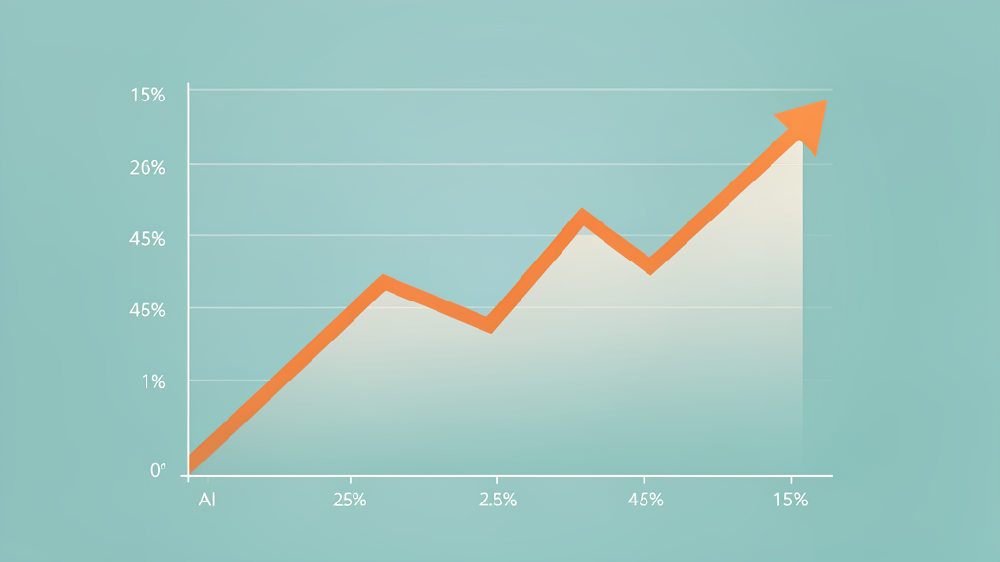
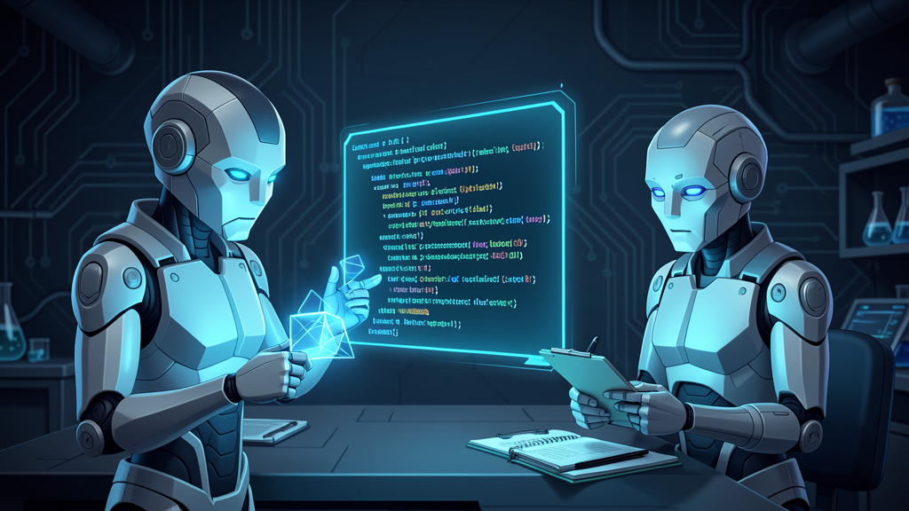
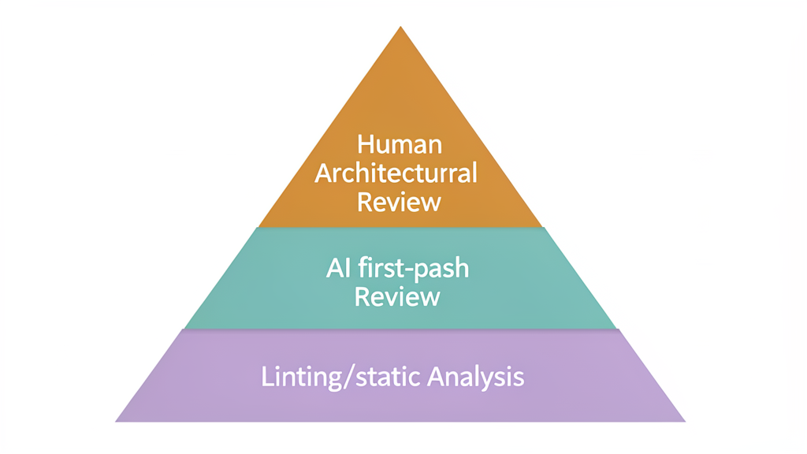
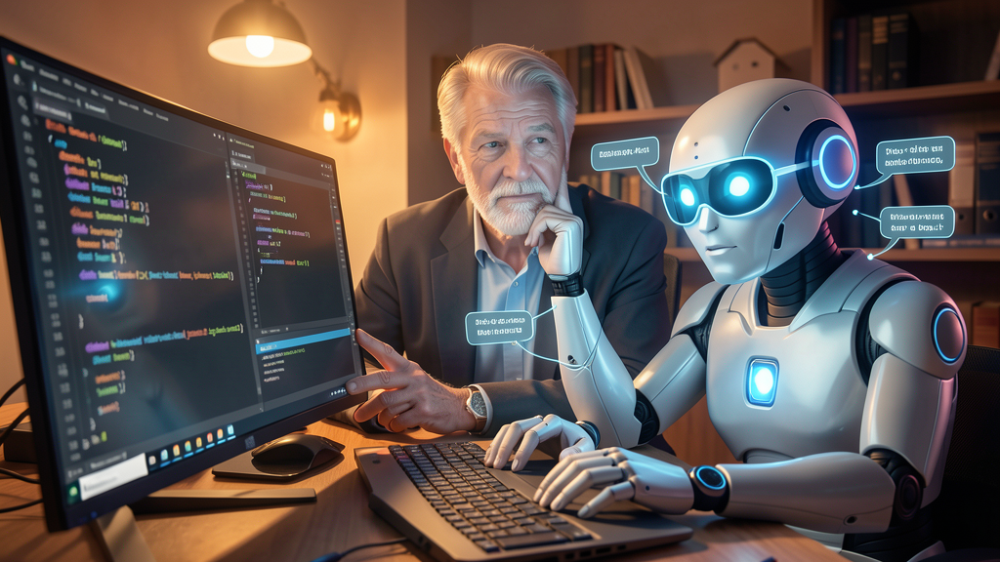

# The Quiet Death of the Code Review

A team of six developers and two seniors replaced their code review process with AI five months ago. Their pull request backlog dropped from 15 to 3. Their juniors started learning faster. Their seniors stopped arguing about formatting.

Nobody outside their Slack channel noticed.

In a post on r/cursor last week, a developer described what happened when their team layered CodeRabbit, Cursor's BugBot, and Claude Code into their review pipeline. CodeRabbit runs a first pass on every PR within minutes. It catches unused imports, missing error handling, edge cases. By the time a human reviewer opens the PR, the surface-level problems are already flagged and usually fixed.

The seniors on the team jumped straight to architecture. The reviews got shorter but sharper. And something nobody predicted: the juniors started improving faster, because the agent explains why something is wrong instead of just leaving a terse comment and moving on.

## This is not one team

That Reddit post sounds like an anecdote. It is. But the data behind it says this is happening at scale.

Pullflow analyzed 40.3 million pull requests between February 2022 and November 2025. AI agent participation in PRs grew from 1.1% to 14.9%. That is a 14x increase in 21 months. The repositories using AI review tools jumped from 300,000 to 1.3 million in the same window.

The tools multiplied. CodeRabbit reviewed over 13 million pull requests (per their own reporting). GitHub Copilot's code review feature hit 60 million reviews by March 2026, ten times its April 2025 numbers, according to GitHub's own data. Google's Gemini Code Assist grew 43x in a single year, per Google Cloud's announcement. Even purpose-built tools like Qodo (formerly PR-Agent) and Greptile carved out niches by specializing in security audits and full-codebase context respectively.

Meanwhile, Korbit, a venture-funded AI code review startup, shut down in 2025. The market is consolidating around incumbents with distribution moats. GitHub owns the pull request. Copilot ships with it for free.

## AI solved the wrong problem

Here is where it gets interesting. AI was supposed to make writing code dramatically faster. Instead, a study from METR (Model Evaluation and Threat Research) found that experienced developers using AI tools completed tasks 19% *slower* than without them, on unfamiliar codebases. Yet those same developers believed they were 20% faster. The tools made them feel more productive while objectively slowing them down. LinearB's 2026 benchmark report, analyzing 8.1 million pull requests across 4,800 organizations, confirmed the pattern at scale: developers feel faster, but shipping velocity has not improved.

The reason is simple. AI made code generation faster, but code generation was never the only bottleneck. Code review was the other one. And now that developers can produce far more pull requests with the same effort, the review capacity has not scaled. The Martian Code Review Benchmark, the first broad evaluation of AI code review tools (released March 2026 by researchers affiliated with DeepMind, Anthropic, and Meta, companies that build the tools being tested), found that AI coding tools *increased* PR review time by 91%.

More code. Same review capacity. Slower shipping.

## So we built AI to review the AI

The obvious solution was to throw AI at the review problem too. And it works, sort of.

The Martian benchmark evaluated 17 tools across 200,000 real pull requests. The best performer, CodeRabbit, achieved a 51.2% F1 score with 49.2% precision. Translation: the best AI reviewer correctly identifies roughly half of real issues. The rest slip through.

CodeRabbit, which sells AI code review tools, reported from its own analysis of 13 million pull requests that AI-assisted code generates 1.7x more issues than human-written code. Seventeen percent of AI-assisted PRs contained issues scoring 9-10 on their severity scale, meaning high probability of production impact. We made code generation faster and buggier, then built AI to catch the bugs, and the AI catches about half of them.

This is the trust gap that two separate data sources captured. Sonar's 2025 survey found that 96% of developers do not trust AI-generated code enough to merge it without human verification. And the Stack Overflow 2025 Developer Survey, with 49,000 respondents across 166 countries, showed positive sentiment toward AI tools dropping from 70% to 60% in a single year despite 84% reporting usage or planned usage.

Ninety-six percent. So the AI writes the code. The AI reviews the code. And then a human has to check the AI that checked the AI. We built a faster pipeline to do the same thing we were already doing.

Stack Overflow's data revealed one nuance: developers who use AI tools daily report higher satisfaction than infrequent users. Whether trust grows with repetition, or whether developers who already trust AI simply use it more, the data cannot tell us. But the overall trend is heading the wrong direction. More usage, less trust.

One commenter on the Reddit thread raised a point that stuck with me. "The real issue is that junior developers are rushing and opening PRs without going through the code themselves." AI lets juniors ship faster, which produces messier PRs, which requires AI review to catch the mess, which lets juniors ship even faster. We are widening the pipeline, not fixing it.

Another commenter added something quieter: "Juniors should review PRs to learn." Code review was never just about catching bugs. It was how junior developers learned to read code. When the bot does the first pass, the junior reads the bot's comment instead of the diff. They learn what the bot catches. They do not learn what the bot misses.

## What seniors do now

The r/cursor post hints at something more interesting than "AI replaced reviewers." What happened instead is a tiered system emerged, and it is changing what senior developers do day to day.

Level one is linting and static analysis. Tools like SonarQube and ESLint catch formatting, imports, and style violations. Some commenters on the Reddit thread pointed out, correctly, that these problems should never reach a human reviewer in the first place. If your seniors were spending 20 minutes on missing imports, your problem was not AI. Your problem was not having a linter.

Level two is AI first-pass review. CodeRabbit, Copilot, BugBot scan for error handling, edge cases, test coverage, and common anti-patterns. This is where the real time savings happen. The Martian benchmark shows the best of these tools catches roughly half of real issues. They generate noise. They flag false positives. But when they work, they clear the underbrush so humans can focus on harder problems.

Level three is human architectural review. This is where seniors operate now. Does the approach make sense? Does this API design scale? Are we creating technical debt that will haunt us in six months? No AI tool can do this well, and the r/cursor post confirms it. The author was explicit: "the architectural judgment still needs a human."

The shift is not that code review died. The bottom two tiers got automated. The top tier is where the judgment lives.

## The real question

In my own work as a tech lead, I have watched this tiered system take shape without anyone designing it. Pull requests that used to sit for two days now get a first-pass AI review in minutes. Juniors on my team ask Claude Code to explain why a pattern is wrong instead of waiting for me to leave a one-line comment they will not understand. The backlog is shorter. The reviews I do give are harder and more consequential.

But I also spend more time debugging AI-generated code that looked right and was not. I trust the tools less than I did six months ago, even as I depend on them more. That tracks with what 49,000 developers told Stack Overflow.

The quiet death of the code review is not really a death. It is a shrink. The mechanical parts of review, the parts that should have been automated years ago, are finally being automated. What remains is the part that always mattered: judgment. The question is whether we will invest as much energy in training human judgment as we have in training the models that pretend to replace it.

The bots are not ready to merge their own work. Not yet. And when they are, we will need someone to check them.

The question is who.