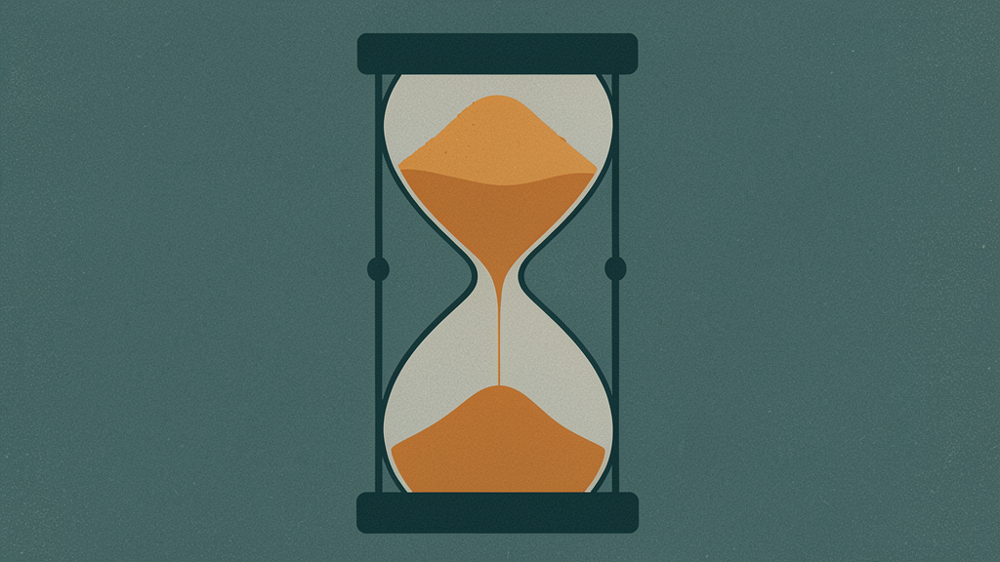
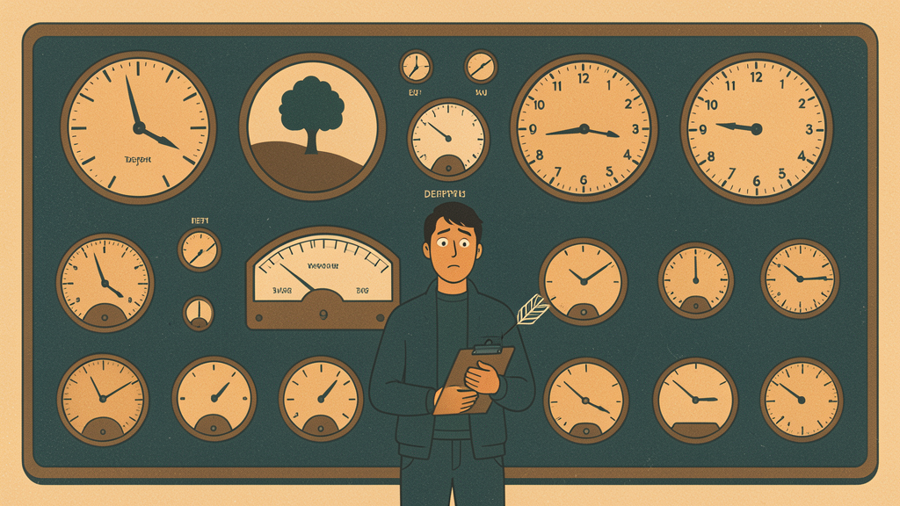

Sonar's latest survey, released in January 2026, found that AI now accounts for 42% of all committed code. Seventy-two percent of developers who have tried AI tools use them every single day. GitHub Copilot adoption has reached nearly half of developers industry-wide.

Your engineering team has never produced this much code.

So why hasn't your shipping velocity increased by 42%?

## The speed illusion

Eighty-nine percent of engineering leaders report AI-driven productivity gains, according to Harness's 2026 State of DevOps Modernization report. The survey, conducted by independent research firm Coleman Parkes, covered 700 engineering practitioners across five countries. The findings are consistent across geographies.

Developers certainly feel faster. In METR's randomized controlled trial — the only RCT of AI coding productivity with experienced developers on real codebases — developers expected AI tools to speed them up by 24%. Even after working with AI on tasks where they were measurably slower, they still believed it had made them 20% faster.

The study was small: sixteen developers completing 246 tasks across mature open-source projects. Its confidence interval was wide enough that the 19% slowdown was not statistically significant on its own. But the perception gap — believing you are 20% faster while being 19% slower — is the finding worth paying attention to.

The feeling is real. The code generation is real. The output on screen is happening faster than ever.

What's not real is the delivery improvement.

## The review bottleneck

LinearB's 2026 Software Engineering Benchmarks Report analyzed 8.1 million pull requests across 4,800 organizations. (LinearB sells engineering metrics software, so its business benefits from organizations believing they have measurement gaps.) It's the largest dataset on AI coding's impact in production to date, though the data is observational, not a controlled experiment, and AI PRs may differ systematically from human ones in task complexity, developer experience, and codebase area.

The headline finding: AI-generated pull requests wait 4.6 times longer for review to begin than human-written ones. Four point six times.

Once a reviewer picks them up, AI PRs are reviewed twice as fast. That sounds positive. It is not. The acceptance rates tell the real story. AI-generated PRs are accepted 32.7% of the time. Human-written PRs: 84.4%. Roughly two-thirds of AI pull requests never make it to merge.

A caveat: low acceptance does not necessarily mean bad code. PRs get rejected for spec changes, design disagreements, scope shifts, and duplicate work. But a 51-point gap between AI and human acceptance rates signals something structural, not just noisy triage.

The math is brutal. Code that writes faster but waits longer and fails more often does not produce faster delivery. It produces a review queue that grows longer every sprint.

Reviewers are not being lazy. They are rationally triaging. AI pull requests are 154% larger on average and contain 75% more logic errors, according to the same LinearB analysis. Senior developers spend 38 minutes reviewing each AI PR and accept only 23.7%. Juniors spend 15 minutes and accept 31.9%. The experienced engineers know what they are looking at.

Eighty-one percent of developers report spending more time on code review since their team adopted AI tools, per the Harness report. Twenty-eight percent say manual work has increased by 30% or more.

The code generation gain is real. It is being eaten by the review bottleneck.

## The verification tax

Here is where the numbers get uncomfortable. Sonar, a code review company, surveyed 1,100 developers in January 2026. Ninety-six percent said they do not fully trust AI-generated code to be functionally correct. Only 48% said they always verify AI output before committing it.

Yes, Sonar sells code review tools. Yes, this is a conveniently self-validating statistic, as The Register noted in their coverage. But even discounting the conflict of interest, the Stack Overflow Developer Survey tells the same story from a neutral source. Positive sentiment toward AI tools dropped from over 70% in 2023 and 2024 to 60% in 2025, even as usage climbed. The top frustration developers reported: AI solutions that are almost right, but not quite.

"Almost right" is the worst possible outcome for a code review. Correct code gets approved quickly. Wrong code gets rejected quickly. Almost-right code requires the reviewer to read every line, mentally simulate the execution, and determine whether the subtle error is a real bug or a stylistic quirk. That is the most expensive kind of review there is.

In my own work leading a data engineering team, I have watched this play out. A junior developer ships a pull request in twenty minutes that would have taken two hours to write manually. The PR touches fourteen files. It looks plausible. I spend forty-five minutes reviewing it, request changes on six files, and the cycle repeats. The net time saved, if any, is marginal. The cognitive cost is higher than before AI.

Harness found that 31% of developer time is now spent on untracked tasks. Reviewing AI-generated code. Fixing bugs it introduced. None of this time appears in any velocity dashboard. It is invisible.

## Code sprawl is compounding

GitClear analyzed 211 million changed lines of code across five years of data from repositories owned by Google, Microsoft, Meta, and large enterprises. Their findings, published in the 2025 AI Copilot Code Quality Report, reveal a troubling pattern.

Code cloning has increased 4x since AI assistants went mainstream. Copy-and-pasted code now exceeds moved code, a proxy for code reuse, for the first time in the history of their dataset. That is not a milestone anyone should celebrate. Short-term churn code, defined as code added and then modified or deleted within two weeks, is rising.

GitClear sells code quality measurement tools, so their incentives line up with finding quality problems. But the pattern is consistent with what every other source shows. More code is being written. Less of it is being reused. More of it is being thrown away shortly after creation.

This is the compound cost that nobody is measuring. Today's code clone is tomorrow's maintenance burden. When you duplicate a block instead of refactoring it into a shared utility, you create two copies that must be updated independently. At AI generation volume, this scales into a real drag on future productivity.

## The measurement vacuum

The most damning number in the Harness report is not about AI at all. It is this: 94% of engineering leaders admit their current metrics frameworks do not capture code quality or developer burnout.

Eighty-nine percent say AI is delivering gains. Ninety-four percent say they cannot measure whether those gains are real.

Fifty-four percent of developers fear that AI productivity data will be used for individual performance evaluation. They are right to worry. When leaders measure lines of code, commit frequency, and PR throughput, AI tools produce beautiful numbers. Beautiful and misleading. When they try to measure code quality, defect rates, review effort, and time-to-recovery, the data does not exist.

This is the productivity paradox. It is not that AI tools are bad. They genuinely accelerate code generation. It is that organizations are measuring the input side of the equation — code written, PRs created, tasks completed — and assuming the output side follows linearly.

It does not.

## The picture is changing

I want to be honest about something. The METR study I referenced, the one that found developers 19% slower with AI, was published in July 2025 using data from February to June 2025. The tools were Cursor Pro with Claude 3.5 and 3.7 Sonnet.

In February 2026, METR published an update. They tried to replicate the study with a larger pool of developers using newer AI tools. They could not make it work. Developers refused to participate because they did not want to work without AI. Thirty to fifty percent of participants chose not to submit tasks they did not want to do without AI assistance. The selection bias was severe enough to make the results unreliable.

METR's raw data from the new experiment shows a possible speedup. Their original developers went from 19% slower to an estimated 18% faster. But the confidence interval, spanning from 38% faster to 9% slower, crosses zero. The new data, like the old data, cannot statistically distinguish between a real effect and no effect at all.

This does not mean AI tools have no impact. GitHub's own controlled study with 95 developers found 55% faster task completion on specific assignments, though that research was vendor-funded and focused on self-contained tasks rather than real codebase work. The honest answer is that nobody has clean, large-scale, independent data on whether AI makes developers faster in production. What we have is a small RCT showing a slowdown, a vendor study showing a speedup, and a follow-up RCT that was too contaminated to answer the question.

The tools are improving. Claude Code, Cursor with Claude 4, and the latest Copilot iterations are meaningfully better than what was available during the METR trial. The 19% slowdown is probably no longer representative of the average experience.

But here is what has not changed. The review bottleneck has not changed. The acceptance rates have not changed. The trust deficit has not changed. The measurement vacuum has not changed. None of it. Code quality metrics from GitClear continue to deteriorate.

AI tools are getting faster at writing code. The system around them — review, verification, quality, measurement — has not improved at all.

## What to do about it

If your team is using AI tools and you cannot point to a corresponding increase in deployment frequency, the problem is not the tools. The problem is what happens after the code is written.

Stop measuring lines of code. Start measuring cycle time from the first commit to the merged PR. Track the acceptance rate of AI-generated PRs separately from human-written ones. Measure the time reviewers spend on each category. Track defect rates in production for AI-assisted versus manual code.

But measurement alone is not enough. If your AI PRs are bloated and low-quality, change the process. Mandate smaller batch sizes for AI-assisted PRs. Require AI-attribution labels so reviewers know what they are looking at. Set higher test-coverage thresholds for AI-generated changes. Pair junior developers with seniors on their first fifty AI-assisted PRs. And recognize that the first two months of adoption will be ugly, with review time spikes and acceptance drops, before teams learn to use the tools well.

The 42% number from Sonar is accurate. AI does account for that share of committed code. But code committed is not code shipped, and code shipped is not value delivered. The gap between those three numbers is where the productivity paradox lives. It is wide.

Your developers are writing more code than ever. The question is whether anyone is measuring what happens to it.

---
*Data sources: METR (arxiv.org/abs/2507.09089), Harness State of DevOps Modernization 2026 (survey by Coleman Parkes, 700 respondents), LinearB 2026 Software Engineering Benchmarks Report (8.1M PRs, 4,800 organizations), Stack Overflow Developer Survey 2025, GitClear 2025 AI Copilot Code Quality Report (211M lines analyzed), Sonar State of Code Developer Survey January 2026 (1,100 developers). Some cited research is produced by vendors (Harness, LinearB, GitClear, Sonar) who sell products in the spaces they research. This article notes those conflicts where relevant.*
