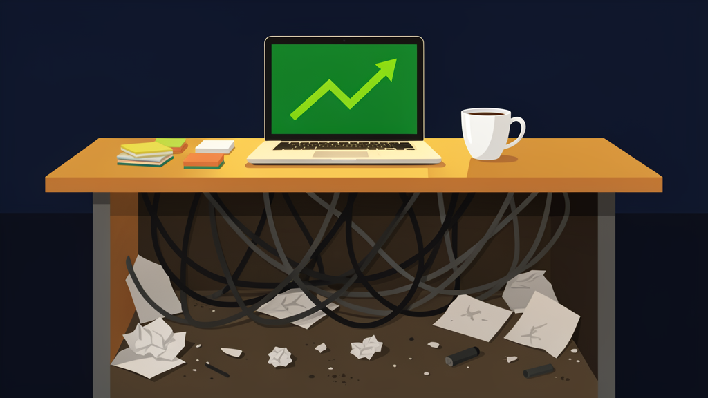
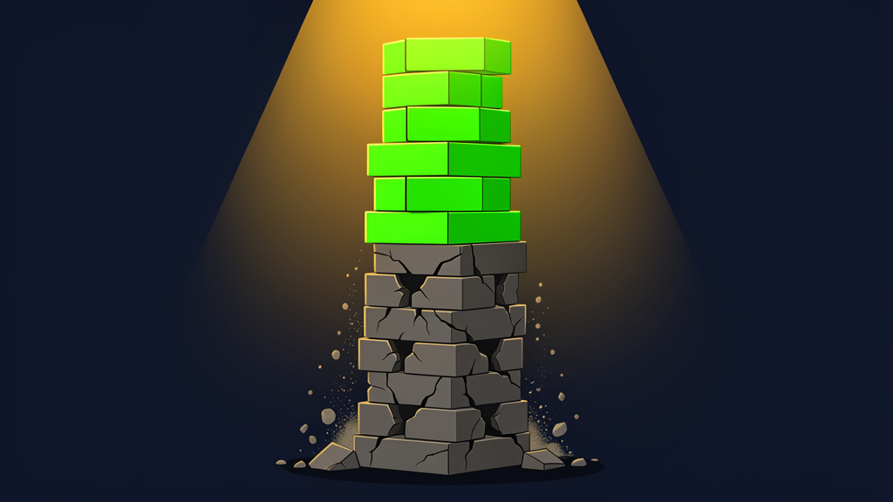

AI coding tools were supposed to make everyone faster. They did something stranger instead: they split engineering teams into two tiers, and the metrics we use can only see one of them.

In January 2026, Sonar (a code quality platform) surveyed 1,100 professional developers and found that 42% of committed code is now AI-generated or AI-assisted, categories that span everything from autocomplete suggestions to full function generation. By 2027, developers expect that to reach 65%. The tools work. The code ships.

But 96% of those developers don't fully trust the AI output. Only 48% always verify it before committing. And 38% say reviewing AI-generated code takes more effort than reviewing code written by a human colleague.

This is the shape of the problem. AI helps you write code faster. It also makes someone else's job harder. And right now, almost no organisation can tell the difference.

## The numbers nobody tracks

Harness released their State of Engineering Excellence report in May 2026, based on 700 engineering practitioners and managers across five countries. The findings are a study in contradiction.

89% of engineering leaders say developer productivity has improved since adopting AI tools. 88% say developer satisfaction is up. The dashboards are green. But those numbers are leaders' perceptions, not measured outcomes.

Meanwhile, 81% of developers say they spend more time in code review since AI adoption. 28% report an increase of more than 30%. The report estimates that roughly 31% of developer time is now consumed by invisible work: reviewing AI-generated code, fixing bugs that slipped through, context switching between tools.

94% of leaders acknowledge that key factors like tech debt and developer burnout are missing from their current metrics. Only 6% believe their measurement frameworks can fix this.

89% say productivity is up. 94% say they can't measure the cost. Leaders see the gains but can't see what they're trading for them.

## The two tiers

Here is what the data describes, even if no report says it this directly. The tiers are roles, not people. The same engineer can occupy both in a single afternoon.

Tier one: the work of shipping. Writing code with Copilot, Cursor, or Claude Code. PR count goes up. Commit frequency looks impressive. On every dashboard the company built, this is the top performer.

Tier two: the work of reviewing and fixing. Reading AI-generated pull requests, catching logic errors, flagging security issues, rewriting non-idiomatic solutions. PR count stays flat. Commit history looks unremarkable. On the same dashboards, this looks average.

Fastly's July 2025 survey of 791 developers found that 32% of senior developers with ten or more years of experience ship code where more than half is AI-generated. For juniors, that figure is 13%. Seniors produce 2.5 times more AI-assisted code than juniors. The same seniors are also the ones reviewing it. They are the heaviest users and the primary auditors.

But Qodo, an AI code review platform, published a 2025 report covering 600 developers. AI-generated PRs averaged 10.83 issues per pull request compared to 6.45 for human-written code. That is 1.7 times more code review issues, including style flags, maintainability warnings, and security findings.

Who catches those issues? Not the person who wrote them. The person who reviews them.

Stephan Schmidt, a developer with 40 years of experience, described it this way: "My brain does not get the baking time to mentally process architecture, decisions and edge cases the AI creates. I'm running a marathon at the pace of a sprint."

Gabriel Scherer, an OCaml maintainer, said reviewing AI-generated code is "more taxing than reviewing human-written code."

Nobody promoted them for it.

## The review tax

LinearB's 2026 Engineering Benchmarks Report analysed 8.1 million pull requests across 4,800 teams in 42 countries. AI-generated PRs wait 4.6 times longer before someone picks them up for review. Once review starts, the reviewer moves through them twice as fast. But the queue delay dominates.

The acceptance rate tells the rest of the story. AI-generated PRs have a 32.7% acceptance rate. Human-written PRs: 84.4%.

Opsera's 2026 benchmark report (Opsera is a DevOps analytics vendor), covering 250,000 developers across 60 enterprises, confirms the 4.6 times wait and adds that AI introduces 15 to 18% more security vulnerabilities per pull request.

So the person shipping AI-assisted code gets a productivity boost. The person reviewing it gets a tax. The dashboards count the boost. They miss the tax entirely.

This is what Tanya Reilly warned about years before AI coding tools existed. In her talk "Being Glue," later expanded into *The Staff Engineer's Path*, she described the work that holds teams together: coordination, documentation, catching miscommunications before they become crises, onboarding new hires because someone has to. She called it glue work.

Her observation was painful: glue work is essential and actively harmful to the careers of the people who perform it, because it crowds out the visible, promotable contributions that organisations tend to reward. It is invisible on performance reviews.

Reviewing AI-generated code is the new glue work. It is the invisible tax that keeps the codebase functional while everyone else's metrics look great. AI code review tools like CodeRabbit and Qodo are emerging to absorb some of this burden, but for now the bulk of it still falls on humans. And just like the original glue work, it falls disproportionately on the same people who are already doing the most consequential work on the team.

## The measurement collapse

The Stack Overflow Developer Survey 2025, with 49,000 responses, shows AI adoption at 84% among developers. Positive sentiment has dropped from 70% in 2023 to 60% in 2025. 46% don't trust the output.

Cui et al., published in *Management Science* in 2025, ran randomised controlled trials with 1,974 developers at Microsoft and Accenture. Copilot users produced 13.5% more completed pull requests. No measurable change in shipped code quality. The study came from researchers at MIT, Princeton, and Wharton.

The Qodo findings seem to contradict this. They don't, exactly. Cui et al. measured quality by what shipped and survived in production. Qodo measured what static analysis flags in review. A PR can pass all tests and deploy cleanly while still carrying maintainability debt that surfaces months later. Both studies are right. They measure different things. The honest answer is that we don't yet know which one predicts long-term outcomes.

The same ambiguity applies to the acceptance rates. AI-generated PRs may have lower acceptance because reviewers apply more scrutiny to them, not because the code is worse. The data cannot distinguish between the two.

13.5% more PRs. That is what the dashboard sees. What it does not see: the senior engineer who spent an extra hour verifying each one.

Engineering metrics were already broken before AI. Story points got inflated. Commits got split. Lines of code got padded. AI did not break the metrics. It made the breakage obvious.

When a junior engineer ships three times more PRs with AI assistance and a senior engineer spends their day reviewing them, the junior looks like a 10x developer. The senior looks like they are falling behind. The organisation rewards the wrong person. The senior burns out. Nobody notices until the codebase starts rotting.

54% of developers in Harness's survey fear individual performance evaluations based on AI productivity data. They should.

## What changes the equation

There is no version of this where we go back to writing code without AI. The 42% of committed code that is AI-generated will be 65% next year. The tools work, and the productivity gains on the writing side are real.

I have been that reviewer. In my role as tech lead, I've watched my own PR count flatten while the queue of AI-assisted pull requests grows longer every sprint. The work that keeps our codebase maintainable, the architectural decisions, the security reviews, the mentorship of juniors who are learning faster than ever but building on shakier foundations, none of it shows up in our engineering dashboard. What shows up is PR count. And PR count tells a story that rewards the wrong people.

The fix is not to measure harder. It is to measure differently. Organizations should track review-hours alongside PR counts. Promotion criteria should explicitly reward engineers who prevent bad code from shipping. Review time is work. Until dashboards reflect that, the gap keeps growing.

## The real cost

The two-tier economy is not a prediction. It is happening now, in teams that use AI tools every day, measured by dashboards that were designed for a world where every PR was written by a human.

The Harness report says it plainly: "AI coding is the first technology shift in modern software that has changed not just what developers build, but how they spend their hours."

94% of engineering leaders know their metrics are broken. 6% think they can fix it.

That gap is where your best engineers are disappearing.
