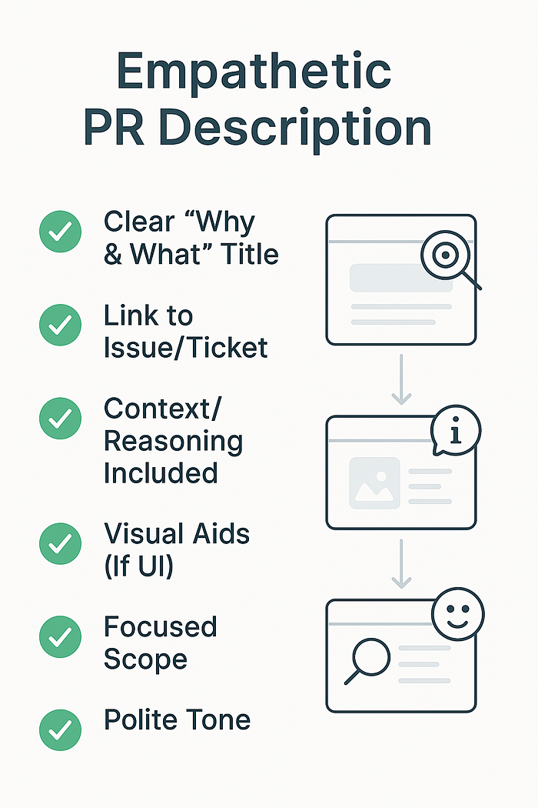
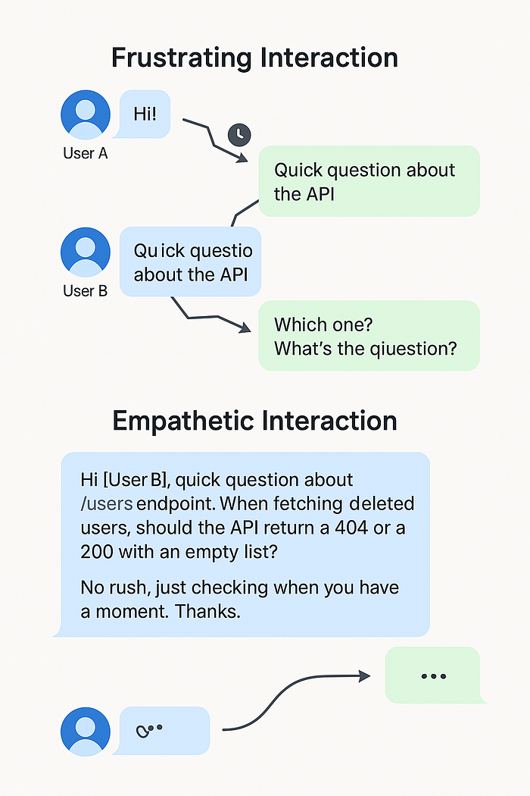

**(Because 'LGTM 👍' Doesn't Always Cut It)**

Hey folks, let's talk about the modern dev reality. Chances are, a big chunk of your communication happens *asynchronously*. Slack messages ping across time zones, Pull Requests get reviewed while you sleep, documentation serves colleagues you might never meet face-to-face. It's efficient, it's flexible… and sometimes, it's a recipe for total confusion.

We've all been there, right? The cryptic Slack message that raises more questions than it answers. The PR comment that feels more like an accusation than feedback. The bug report so vague it requires psychic powers to diagnose. Or maybe you've been the sender, firing off a quick message only to get bogged down in endless back-and-forth later?

This isn't just about typos or bad grammar. Often, the missing ingredient is **empathy**. Not just being nice (though that helps!), but truly considering the recipient's perspective when crafting our async messages. Mastering *empathetic* async comms isn't just fluff; it's a core skill for saving time, reducing friction, and building awesome software together.

## What's "Empathetic" Async Comms, Really? (Hint: More Than Emojis)

At its core, empathetic asynchronous communication means putting yourself in the recipient's shoes *before* you hit send. It's about:

- **Anticipating Needs:** What context does the reader need to understand this? What questions will they likely have?
- **Providing Context Proactively:** Don't make them dig or guess. Offer background info, links, screenshots — whatever helps them get up to speed quickly.
- **Structuring for Clarity:** Organize your thoughts logically. Use formatting (bullets, headings, bolding) to make information scannable and digestible.
- **Respecting Time & Focus:** Craft messages that minimize unnecessary back-and-forth or demands for immediate attention.
- **Considering Tone:** Text lacks non-verbal cues. Be mindful of how your words might be interpreted. Could that direct statement sound harsh? Add a softener if needed.

It's the difference between tossing a problem over the fence and handing someone a clear map to the solution.

## Your Empathetic Async Toolkit: Practical Tips Channel-by-Channel

Let's break down how to apply empathy in the places developers communicate most:

### 1. Pull Requests (PRs): Show Your Reviewers Some Love ❤️

**Why Empathy Matters:** Your reviewers are taking time out of *their* day to help *you*. Make it easy for them! Don't force them to decipher your code's intent or the reason for changes.

**Empathetic Tactics:**

- **Crystal Clear Title & Description:** Explain the **WHY** (what problem does this solve? what feature does it add?) and the **WHAT** (high-level summary of the changes). Don't just restate the ticket title.
- **Link Everything:** Connect to the relevant Jira ticket, GitHub issue, design mockups, or previous discussions. Context is king!
- **Visual Aids:** For UI changes, include screenshots, GIFs, or Loom videos. A picture *is* worth a thousand lines of code review comments.
- **Preempt Questions:** Did you make a non-obvious choice? Briefly explain your reasoning *in the description*. Considered alternatives? Mention them.
- **Keep 'Em Focused:** Smaller, focused PRs are easier (and faster) to review. Big PRs can feel overwhelming and signal less empathy for reviewer time.

### 2. Documentation (Docs & READMEs): Be Kind to Future You (and Everyone Else)

**Why Empathy Matters:** You might be writing this for a new teammate onboarding next month, or even yourself six months from now when you've forgotten all the details. Assume the reader knows less than you do right now.

**Empathetic Tactics:**

- **Logical Structure:** Use clear headings, maybe a Table of Contents. Make information findable.
- **Working Examples:** Include clear setup instructions and copy-pasteable usage examples.
- **Explain the Rationale:** Why was this designed this way? Briefly explaining architectural choices helps future understanding.
- **Define Your Terms:** Avoid assuming everyone knows that obscure acronym or internal project codename. Spell it out or link to a glossary.
- **Keep It Alive:** Outdated docs cause confusion. Make updating docs part of your definition of done (empathy for accuracy!).

### 3. Issue Tracking (Jira, GitHub Issues): Help Me Help You!

**Why Empathy Matters:** Whether reporting a bug or requesting a feature, the person acting on this ticket needs clear, actionable information. Vague tickets waste time.

**Empathetic Tactics:**

- **Descriptive Titles:** "Bug in checkout" is bad. "Checkout Fails with 500 Error When Applying Coupon Code X" is good.
- **Bug Reports:** Provide detailed steps to reproduce, environment details (browser, OS), expected result vs. actual result. Include logs, screenshots, or error messages.
- **Feature Requests:** Clearly define the user story or goal, provide acceptance criteria (how will we know it's done correctly?), mention any constraints or requirements.

### 4. Chat/Messaging (Slack, Teams): Respect the Focus Bubble

**Why Empathy Matters:** Instant messaging feels synchronous, but often isn't. People might be in deep focus, in meetings, or in different time zones. Ambiguity creates disruptive back-and-forth.

**Empathetic Tactics:**

- **No Naked "Hi":** Don't just type "Hi" or "Quick question" and wait. Get straight to the point in your first message. Include the context and the question.
- **Structure Long Thoughts:** Use bullet points, numbered lists, or separate paragraphs for readability if your message is complex. A wall of text is hard to parse.
- **Thread Wisely:** Keep discussions on topic within threads to avoid cluttering main channels.
- **Indicate Urgency (Or Lack Thereof):** If it's not urgent, say so! "No rush on this…" or "When you get a chance…" respects their time. If it is urgent, explain why briefly.
- **Proofread for Tone:** Read it aloud quickly. Does it sound abrupt? Could adding a "Please" or "Thanks" help? (But don't overdo it!).
- **Summarize:** If a long chat discussion reaches a conclusion or action item, summarize it clearly at the end.

## When Async Waters Get Choppy: Handling Disagreements Empathetically

Disagreements happen. Doing it asynchronously adds layers of difficulty because tone and intent get lost. Here's how empathy helps navigate conflict via text:

**Pause & Assume Positive Intent:** Got a PR comment that feels blunt? A Slack message that seems dismissive? Take a breath. Before reacting, assume the other person meant well but perhaps phrased it poorly. Don't jump to conclusions.

**Seek to Understand First:** Instead of immediately arguing back, ask clarifying questions. "Could you help me understand the concern about X?" or "What specific alternative did you have in mind?" shows you're listening.

**Focus on the Issue, Not the Person:** Frame your points around the code, the requirements, or the impact, not the individual.

- Avoid: "Your approach is wrong."
- Try: "I'm wondering if this approach might run into issues with [specific scenario]? An alternative could be…"

**Acknowledge Their Point:** Show you've heard them before presenting your counter-argument. "I understand the desire for simplicity here. However, I think we also need to consider…" Validating their view (even if you disagree) de-escalates tension.

**Provide Clear Rationale:** Explain why you disagree or prefer a different approach. Back it up with data, principles, documentation links, or logical reasoning.

**Know When to Bail to Sync:** If a text-based back-and-forth starts going in circles, getting heated, or becoming inefficient, be the one to suggest a quick synchronous chat. "This is getting complex — maybe a quick 5-minute call would help us sort this out faster? I'm free at X or Y." It shows empathy for resolving the issue effectively.

## The Awesome Payoff: Why Bother Being an Async Empath?

Investing in empathetic async communication isn't just "nice"; it's smart:

- **Fewer Misunderstandings:** Clear context reduces confusion and errors.
- **Faster Resolutions:** Less back-and-forth means problems get solved and decisions get made quicker.
- **Increased Productivity:** Less time wasted deciphering messages or waiting for clarification.
- **Better Collaboration:** Smoother interactions build trust and psychological safety.
- **Improved Knowledge Sharing:** Clearer docs and issues benefit everyone long-term.
- **More Inclusive Teams:** Respects different communication styles, time zones, and focus needs.
- **Constructive Conflict:** Disagreements get resolved more effectively and with less collateral damage to relationships.

## Cultivating Your Async Empathy Muscle: It Takes Practice

Becoming more empathetic in your async comms is a skill you can develop:

- **The Pre-Send Pause:** Before hitting send, quickly re-read your message from the recipient's point of view. What might be unclear? What questions might they have?
- **Seek Feedback:** Ask trusted colleagues occasionally: "Was that PR description clear?" or "Did my explanation in Slack make sense?"
- **Observe Others:** Pay attention to team members whose async communication you find particularly clear and effective. What techniques do they use?

## Conclusion: Write Smarter, Code Better, Work Happier

In our increasingly distributed world, mastering empathetic asynchronous communication is no longer a soft skill — it's a fundamental part of effective software development. By taking a moment to consider the recipient, provide context, structure clearly, and handle disagreements thoughtfully, we can save ourselves (and our teammates) countless hours of frustration.

It's about working smarter, building stronger relationships, and ultimately, creating better software together. So go forth, communicate with empathy, and maybe, just maybe, make your team's Slack channels and PR queues a slightly happier place to be.
