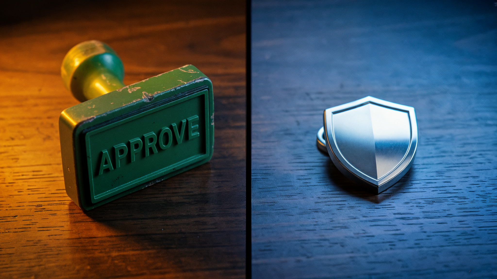

Anthropic just made a decision that tells you exactly where AI coding tools are going. On August 14, Claude Code started running in auto mode by default for everyone on Pro, Max, and Team plans. No more clicking "yes" on every bash command. The permission prompt, the one thing standing between your codebase and whatever the model decides to do, is now optional.

This is not a settings tweak. It is a philosophical position. Anthropic is betting that a classifier model reviewing tool calls is safer than a human rubber-stamping them. The data they published backs that claim. But here is the catch: every study, every evaluation, every piece of safety data comes from Anthropic themselves or from firms they hired. No independent peer-reviewed validation exists. The question is not whether the data looks convincing. It is whether it holds up in conditions Anthropic did not control.

## The numbers that justified the switch

Anthropic hired 1,053 paid testers for a controlled study. Partway through each session, one permission prompt was quietly swapped for a clearly dangerous command. Not borderline. Obviously destructive. The testers knew they were being evaluated, though not on what specifically.

Humans caught it 13.6% of the time. Auto mode caught 89%.

The study was controlled but artificial. Testers worked in a sandbox environment, not their real codebases. The dangerous command was obviously destructive rather than a subtle multi-step exploit. Real attacks would be more sophisticated, buried in trusted dependencies, disguised as legitimate workflow steps. The 89% catch rate is a floor under controlled conditions, and adversarial conditions are harder.

That gap gets worse the longer you work. Humans blocked about 17% of dangerous commands early in a session. After fifty or more prompts, that number dropped to around 5%. Auto mode's performance stayed flat regardless of session length. The model does not get tired, bored, or distracted by the task it was building.

Then there is the confirmation fatigue problem. Anthropic's own telemetry shows users approve 97% of permission prompts. They reject 3%. Compare that to plan reviews, where users reject 39%. The gap tells you something uncomfortable: developers genuinely read plans. They do not read permission prompts. The prompt has become a ritual. A ceremony, nothing more.

The settings files confirm it. Nearly half of active CLI users had already written their own bash allow-rules by June 2026. Sixty-two percent had used bypassPermissions or clicked "don't ask again" on bash commands. A quarter of interactive sessions were already starting with all checks disabled. The permission prompt was not protecting anyone. It was in the way.

## How auto mode works

The mechanics are straightforward. Before each tool call, a separate classifier model reviews the proposed action. If it looks irreversible, destructive, or aimed outside your environment, the classifier blocks it and redirects Claude to find another approach. Safe actions proceed without interruption.

If the classifier blocks three actions in a row, or twenty across a session, auto mode gives up and drops back to manual approval. Those thresholds are not configurable. The idea is that repeated blocks usually mean the classifier is missing context about your infrastructure. Claude is probably trying to do something reasonable that looks dangerous without that context.

The classifier blocks a specific set of actions. Mass deletion on cloud storage. Granting IAM or repository permissions. Force pushes. `git reset --hard`. `terraform destroy`. Sending sensitive data to external endpoints. Production deploys and migrations. Anything that pipes a remote script into bash. The list is designed around things you cannot undo.

## The prompt injection claim

This is the part that deserves the most scrutiny. Anthropic commissioned Trajectory Labs to run an independent evaluation. Seventy-two indirect prompt injection scenarios, each executed ten times, for 720 total attack attempts per model. Against Claude Fable 5, Opus 5, and Sonnet 5 running auto mode, zero attacks succeeded.

Zero. Out of 720.

For comparison, GPT-5.6 Sol running in Codex's Auto-review mode at maximum reasoning effort had a 5.83% attack success rate. That is roughly 42 successful attacks out of the same 720 attempts. Anthropic notes that OpenAI released a new version of Auto-review the following week that could change these results, so the comparison is a snapshot rather than a verdict.

Simon Willison, who has been tracking prompt injection longer than most, called this a claim he would love to believe. He also described a specific attack vector he is not sure auto mode can handle: a malicious package that instructs Claude to run an innocent-looking fetch command before the test suite, where the fetch command itself exfiltrates data. The package instructions look like legitimate documentation. The harm is buried one layer deep.

*Human catch rate (13.6%) vs auto mode (89%). The bar on the left is barely visible.*

I think about that attack vector in the context of my own setup. I run coding agents daily through a platform I work with, and the permission prompt has never visibly stopped me from something I later recognized as dangerous, because I click "yes" like everyone else, and removing the prompt entirely while trusting a classifier to catch what I would have missed raises a different question entirely. What happens when the classifier is wrong in a way the prompt would have caught?

## The production data

Anthropic looked at their own flagged sessions from May and June 2026, examining only accounts that had opted into data use for training and analysis, and re-grading each one with a model on two scales: harm severity and how explicitly the user had asked for the action. Sessions that went through manual approval contained serious unintended harm more than twice as often as auto mode sessions. At production severity, 6.3% of manually approved sessions had a harmful action the user did not ask for, compared to 2.4% of auto mode sessions.

They also worked with Apollo Research on a two-week pilot, injecting synthetic attacks into real coding trajectories. After hardening, the classifier's miss rate dropped from 12% to 7% on adversarial test sets. Anthropic notes these attacks are synthetic and built to break the system, so the 7% should not be treated as the real-world miss rate.

Among Teams and Enterprise adopters, auto mode users shipped about 25% more pull requests. Whether that is because auto mode makes people faster or because more active developers self-select into auto mode is hard to separate. Teams at Adobe, Nuro, Gusto, and Garner Health already run it as their production default.

## The boundary problem

There is one detail buried in the documentation that anyone using auto mode should understand. If you tell Claude something in conversation, like "don't push to main" or "wait for my review before deploying," the classifier treats that as a block signal. It will enforce your stated boundaries.

But boundaries are not stored as rules. The classifier re-reads them from the transcript on every check. If context compaction removes the message where you stated the boundary, the boundary disappears. For a guarantee that survives long sessions, you need to write a deny rule in your settings file, not say it out loud.

This is not a theoretical concern. Long coding sessions with agents regularly hit context limits. The boundary you set at prompt three might not exist by prompt two hundred.

## My honest take

I have been running coding agents with varying levels of autonomy for months. The permission prompt stopped being a safety mechanism for me a long time ago. It became a tax on focus. Every interruption costs more than the approval itself because it breaks whatever mental model I was holding about the task. You lose the thread. You click yes. You try to remember what you were thinking about three seconds ago.

But auto mode is not removing the tax. It is moving it. The cost shifts from the developer, who was paying in attention and context-switching, to the classifier, which pays in accuracy. The question is whether the classifier's error rate is lower than the developer's rubber-stamp rate. On the data Anthropic published, it is. Comfortably.

The part that gives me pause is not the headline numbers. It is the 7% miss rate on adversarial attacks. It is the attack vector Willison described. It is the fact that boundaries vanish under context compaction. These are not reasons to keep the permission prompt. They are reasons to understand that auto mode is not the end of safety decisions. It is the beginning of a different set of them.

A third option exists too, and the article has not mentioned it yet. A lot of developers skip permissions entirely and run their agents inside Docker containers or virtual machines where nothing on the machine matters. If the agent deletes everything, you spin up a fresh container. Auto mode does not compete with that approach. It competes with the default experience for the majority of developers who were never going to set up container isolation. The bet is that automated safety beats broken manual safety for people running unprotected on their real machines.

*The old safety mechanism and the new one. The question is whether the shield is better, or just less obvious.*

## What changes for you

If you are on Pro, Max, or Team, your next session already runs in auto mode unless you pinned a different default. Enterprise and API accounts stay opt-in for now. The classifier overhead is no longer charged on Pro, Max, and Team plans as of August 7.

You can still switch modes with Shift+Tab. Manual mode is still there. Plan mode is still there. If you want the old behavior back, set `"defaultMode": "default"` in your settings file. Nothing is forced.

But here is the honest read. Anthropic did not make auto mode the default because they think it is perfect. They made it the default because the thing it replaces was already broken. A 97% approval rate is not a safety system. It is theater. And the data shows the theater was failing more often than people realized.

The bet is not that the classifier will never make a mistake. The bet is that its mistakes will be rarer and less severe than the mistakes humans were already making every time they clicked "yes" without reading the command. On the evidence available, that is a reasonable bet.

It is also a bet that shifts responsibility. When a human approves a destructive command, the human is at fault. When a classifier lets one through, the vendor is at fault. That accountability transfer is the real story here, and it is the one nobody is talking about yet.

Think about what happens the first time auto mode lets a destructive command through in a production environment. The developer will say they trusted the classifier. Anthropic will say the classifier is not perfect and they disclosed the limitations. The blame moves from the person who clicked a button to the company that removed the button. That is a qualitatively different relationship between vendor and user, and it happened with a settings change nobody voted on.
