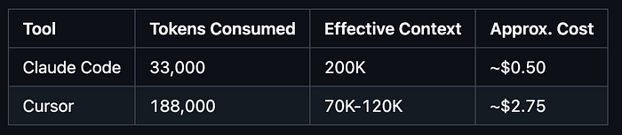
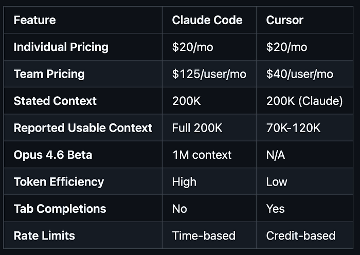

## TL;DR

- Claude Code uses 5.5x fewer tokens than Cursor for identical tasks (33K vs 188K in one benchmark) — that's the difference between a $50 API bill and a $275 bill.
- Context windows aren't created equal: Claude Code gives you the full 200K; Cursor users report 70K-120K usable before quality degrades.
- The pricing story has wrinkles: Individual plans match at $20/mo, but Cursor's credit system has horror stories, and Claude's team pricing ($125/user) stings compared to Cursor's $40/user.

## Context: What Changed and Why Now

Five months ago, the comparison was simple: Cursor for IDE, Claude Code for terminal. That framing is dead. Both tools now have background agents, CLI access, and overlapping capabilities. Claude Code runs in VS Code, has a desktop app, and launched a browser-based IDE. Cursor shipped a CLI in January 2026.

The real difference in 2026 comes down to workflow philosophy and how much autonomy you give AI. Cost matters too, and the billing mechanics matter more than the sticker price.

## Mental Model

Think of token usage like fuel efficiency. Two cars, same destination, wildly different gas consumption. The sticker price tells you nothing about operating costs.

- Cursor loads everything: open files, imports, semantic matches, git history. You pay for all of it.
- Claude Code fetches what it needs, when it needs it. Aggressive pruning, targeted loading.

## The Token Efficiency Metric



Based on Claude Sonnet pricing at ~$3/million input tokens. That's a 5.5x difference. Run that multiplier across a year of heavy usage.

## Head-to-Head Comparison



## The Credit System Horror Story

Cursor uses credit-based pricing. At least one team burned through a $7,000 annual subscription in a single day. Claude Code uses time-based limits: 5-hour rolling window + 7-day weekly cap. No surprise bills, but hard ceilings.

```
#!/bin/bash
# compare_tokens.sh - Measure token usage
TASK_PROMPT="Refactor authentication to use JWT"
REPO_PATH="./sample_repo"

# Claude Code measurement
claude_output=$(claude code --repo "$REPO_PATH" --prompt "$TASK_PROMPT" --json 2>&1)
claude_tokens=$(echo "$claude_output" | jq -r '.usage.total_tokens')
echo "Claude Code tokens: $claude_tokens"

# Cursor measurement (if CLI available)
if command -v cursor &> /dev/null; then
    cursor_output=$(cursor --repo "$REPO_PATH" --prompt "$TASK_PROMPT" --json 2>&1)
    cursor_tokens=$(echo "$cursor_output" | jq -r '.usage.total_tokens')
    echo "Cursor tokens: $cursor_tokens"
fi
```

## Quick Token Estimator

```
def estimate_tokens(file_count: int, avg_lines: int = 150) -> dict:
    tokens_per_file = avg_lines * 4
    # Cursor: generous loading (~3x files)
    cursor_tokens = file_count * 3 * tokens_per_file
    # Claude: targeted loading (~1.5x files)
    claude_tokens = int(file_count * 1.5) * tokens_per_file
    return {
        "cursor": cursor_tokens,
        "claude_code": claude_tokens,
        "ratio": round(cursor_tokens / claude_tokens, 2)
    }

print(estimate_tokens(50))
# {'cursor': 90000, 'claude_code': 45000, 'ratio': 2.0}
```

## Production Hardening

### Claude Code: The Rate Limit Wall

Batch heavy work. Don't spread agentic tasks across the day.

### Cursor: The Credit Cliff

Set credit alerts. Test with small tasks before committing to large ones.

## Failure Modes & Debugging

### Both: Context Quality Degradation

- Cursor: Pulls too much, truncates. Early files well-represented, later ones fuzzy.
- Claude Code: May over-prune. Explicitly mention relevant files in prompt.

## Practical Checklist

- Calculate monthly token burn
- Check team size (pricing gap matters at 10+ users)
- Test both on your codebase
- Decide if tab completions are non-negotiable
- Set up usage monitoring
- Consider hybrid approach

## References

- Claude Code vs Cursor — Detailed analysis of token efficiency and context handling (Builder.io)
- Claude Code vs Cursor Comparison — Additional perspective on practical differences
- Cursor Credit Depletion Story — Team report of spending $7K in a single day
- Claude Code Rate Limits — Details on rate limiting mechanics
