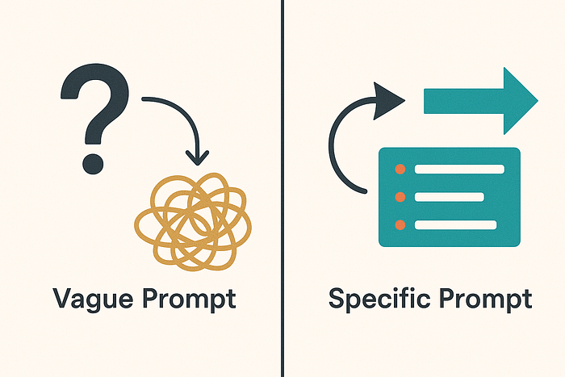

(Or: How I Learned to Stop Worrying and Love the Language Model)

Hey fellow devs, code slingers, and digital adventurers! Gather 'round the virtual campfire. Let's talk about our newest, sometimes quirky, often brilliant, occasionally baffling team member: Artificial Intelligence. Specifically, let's chat about how we talk to it — the art and science of prompting.

If you've spent any time poking around with AI tools, you know the drill. Sometimes, it feels like you've unlocked a genie, granting your every coding or content wish. Other times… well, it's like trying to explain recursion to a particularly stubborn goldfish. The difference? Typically, it boils down to the prompt.

Mastering prompting isn't some dark art reserved for silicon sorcerers. It's rapidly becoming a core skill for us developers. It's about learning the AI's language, understanding its quirks, and guiding it effectively. So, let's ditch the confusion, share a few laughs about the common blunders, and level up our prompt-fu together!

## Oops! Common Prompt Pitfalls & Facepalm Moments We've All Made

Ah, the AI prompt blunder. We've all been there. You ask for something simple, and the AI returns… abstract poetry about the existential dread of toasters. Let's dissect some classic mistakes:

**The "Be More Specific!" Vague Request Syndrome:**

- The Crime: Asking things like "Write some code" or "Tell me about databases."
- The Result: You get something, but it's probably generic, unhelpful, or wildly off-target. It's the AI equivalent of shouting "Make food!" into a kitchen — you might get something, but probably not the gourmet meal you envisioned.
- The Fix (Preview): Specificity is your best friend. What code? What language? What should it do? Which aspect of databases?

**Forgetting the Context: The Amnesiac AI Problem:**

- The Crime: Expecting the AI to remember previous unrelated conversations or assume knowledge you haven't provided in the current context.
- The Result: The AI acts like Dory from Finding Nemo, blissfully unaware of what you were just discussing. It generates responses based only on the immediate prompt info.
- The Fix (Preview): Treat each significant interaction (or prompt within a session) as needing its own setup. Provide necessary background info every time.

**Ignoring the AI's "Personality" & Limits:**

- The Crime: Treating all AIs the same, or asking a model optimized for code generation to write a marketing jingle (and expecting brilliance).
- The Result: Subpar output. You wouldn't ask a fish to climb a tree, right? Different models have different strengths.
- The Fix (Preview): Know your tool! Understand what the AI you're using is good at and tailor your requests accordingly.

**The Bias Booby Trap: Unintentionally Skewed Signals:**

- The Crime: Phrasing prompts in a way that subtly (or not so subtly) encourages biased or stereotypical outputs. Remember, AI learns from vast datasets, which can contain human biases.
- The Result: The AI dutifully reflects and sometimes amplifies those biases. Yikes.
- The Fix (Preview): Be mindful of your wording. Strive for neutral language. Critically evaluate the output for hidden assumptions.

**Garbage In, Garbage Out (GIGO): AI Edition:**

- The Crime: Feeding the AI messy, unclear, or poorly structured information and expecting pristine results.
- The Result: The AI gets confused, makes questionable assumptions, or produces equally messy output. It's the timeless GIGO principle, now on AI steroids.
- The Fix (Preview): Clear, well-structured input significantly increases your chances of getting clear, well-structured output.

Sound familiar? Don't sweat it. Recognizing the pitfalls is the first step to avoiding them. Now for the fun part: becoming a prompt master!

## Level Up! Techniques for Prompt Mastery

Ready to transform your AI interactions from frustrating guesswork to predictable power? Let's explore some practical techniques:

**Provide Rich Context:** Don't make the AI guess! Set the scene. Explain the background, the goal, the constraints. The more relevant information you provide upfront, the better the AI can tailor its response.

- Instead of: "Write a function to sort users."
- Try: "Write a TypeScript function for a Node.js backend using lodash (if necessary) that sorts an array of user objects `{ id: number; name: string; signupDate: Date }` by signupDate in descending order."

**Assign a Role/Persona:** This is surprisingly effective! Tell the AI who it should be.

- Example: "Act as a senior backend developer specializing in secure API design. Review the following code snippet for potential security vulnerabilities…" This primes the AI to focus on specific aspects relevant to that role.

**Specify the Output Format:** Want JSON? Need markdown? Crave bullet points? Just ask! Explicitly defining the desired format saves you clean-up time later.

- Example: "Summarize the key benefits of using Redis for caching in a web application. Present the summary as a bulleted list within a JSON object under the key 'redisBenefits'."

**Use Few-Shot Examples:** Show, don't just tell. Provide 1–3 examples of the kind of input and output you want. This gives the AI a concrete pattern to follow.

- Example: If you want text transformed, show it:
  - Input: "Make this sentence passive." → Output: "This sentence should be made passive."
  - Input: "Summarize this paragraph concisely." → Output: [Your concise summary example]
  - Input: "[Your new text to transform]" → Output:

**Break It Down:** Don't try to get the AI to write your entire application in one go (please!). Deconstruct complex tasks into smaller, manageable prompts. Generate a function, then ask for tests, then ask for documentation, etc.

- Think of it like building with LEGOs — piece by piece!

**Iterative Refinement: The Debugging Loop:** Your first prompt might not be perfect. That's okay! Treat it like debugging code. See the output, analyse what's wrong or missing, tweak the prompt, and try again. Sometimes adding a constraint, clarifying a term, or rephrasing is all it takes.

## Prompting Best Practices: The Cheat Sheet

Keep these golden rules handy:

- **Clarity and Specificity are King & Queen:** Be unambiguous. Avoid jargon the AI might misinterpret (unless you define it).
- **Experiment with Phrasing:** Sometimes, rewording your request can yield dramatically different (and better) results.
- **Control Output Length and Detail:** Use phrases like "Keep it concise," "Explain in detail," "Limit the response to 100 words," etc.
- **Consider Temperature/Top-p (If available):** These settings often control randomness.
  - Low Temperature (e.g., 0.2): More focused, predictable, deterministic outputs. Good for factual answers, code generation.
  - High Temperature (e.g., 0.8): More creative, diverse, sometimes unexpected outputs. Good for brainstorming, content generation.
  - Think of it like: Low temp = sticking to the recipe; High temp = improvising in the kitchen.

## The Human Touch: Why You're Still the MVP (Most Valuable Programmer)

Okay, let's address the elephant in the room (or perhaps the ghost in the machine?). AI is powerful, but it's a tool. A co-pilot. A ridiculously fast and knowledgeable intern, maybe. But you are still the pilot, the architect, the seasoned expert.

- **AI as Co-Pilot, Not Autopilot:** Use AI to augment your abilities, not replace your judgment. It can draft code, suggest ideas, find bugs, but you need to steer, validate, and make the final decisions.
- **Critical Thinking & Validation:** Never blindly trust AI output. Always review, test, and verify its suggestions. Does the code actually work? Is it efficient? Is it secure? Does the explanation make sense? Apply the same rigour you would to a Stack Overflow snippet or a junior dev's PR.
- **Ethical Guardrails:** You are the human checkpoint for responsible AI use. Watch for bias, ensure fairness, consider the implications of the generated content or code. The AI doesn't have ethics; you do.
- **Refining & Integrating:** AI output is often raw material. It needs your expertise to refine it, integrate it thoughtfully into the larger project, and ensure it meets requirements beyond the literal interpretation of the prompt.

Your experience, your intuition, your understanding of the bigger picture — these are things AI can't replicate. It's a powerful force multiplier, but you're the one applying the force multiplier correctly.

## Go Forth and Prompt Bravely!

Mastering AI prompting is a journey, not a destination. It's about developing intuition, learning through experimentation, and maybe even having a little fun with the weird outputs along the way.

So, embrace the process! Treat your prompts like code: write, test, debug, refactor. Use these tips, avoid those common facepalm moments, and remember that the human element — your critical thinking, your ethical compass, your expertise — is more crucial than ever.

Now, go forth and prompt bravely, you magnificent AI whisperers! What are your favourite prompting tricks or funniest AI fails? Share them in the comments below!
