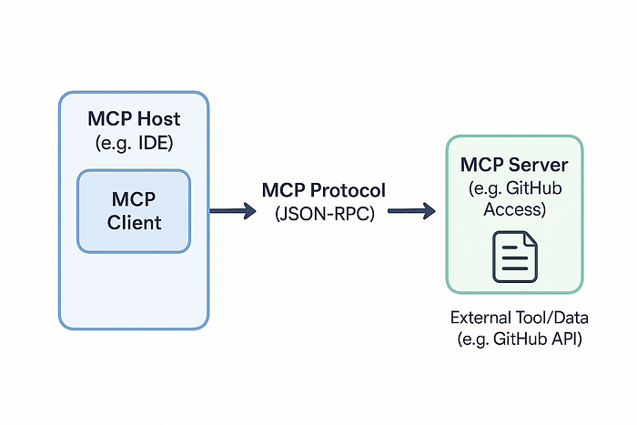
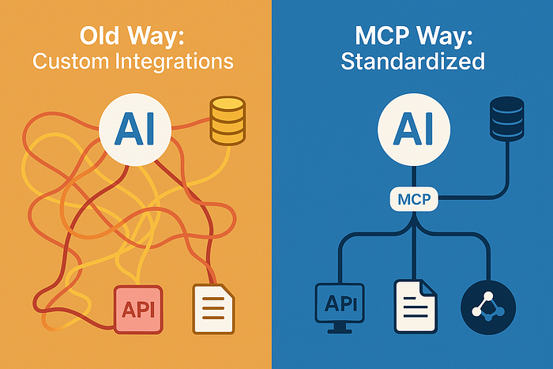

(Okay, Maybe Not Ditched Entirely, But Way Less Glue!)

Hey Devs! Let's talk about AI assistants. Love 'em, right? From whipping up boilerplate code faster than you can say "caffeine dependency" to explaining cryptic error messages, they're becoming indispensable teammates. But let's be honest, getting them to truly understand our world — our codebase, our Jira tickets, our specific APIs, that one quirky internal tool Bob built in 2015 — can feel like pulling teeth.

We've seen flashes of brilliance. Tools like the AI-first Cursor IDE have wowed us with their ability to seemingly grasp the context of our entire project. Yet, often we hit a wall. The AI knows our code, maybe, but feels disconnected from everything else. Connecting it to external tools often means wrestling with bespoke plugins, flaky custom scripts, or just copy-pasting like mad. It's the digital equivalent of trying to connect a monitor, keyboard, and mouse using different, proprietary plugs for each. Annoying, right?

What if there was a standard? A kind of "USB-C port for AI" allowing our models and tools to talk seamlessly to databases, APIs, file systems, and more?

Enter Model Context Protocol (MCP). It's not just a theory; it's an open standard, spearheaded by Anthropic, that's gaining real traction, and it might just be the key to unlocking the next level of AI-driven developer productivity.

## So, What's the Buzz? Introducing Model Context Protocol (MCP)

At its heart, MCP is an open standard designed to solve the messy problem of connecting AI models (like LLMs) to external "stuff" — tools, data sources, APIs, you name it. Instead of every tool inventing its own way to pipe data in and out of an AI, MCP provides a common language and structure.

Think of its client-server architecture:

1. MCP Host: This is the application the user interacts with, where the AI model often lives or is accessed. Think IDEs, AI chatbots, agent frameworks.
2. MCP Client: Lives inside the Host. It's the component that knows how to speak MCP.
3. MCP Server: This is a separate, often lightweight service specifically designed to expose a certain capability (like reading files, accessing a database, interacting with a specific API like Jira or GitHub) using the MCP standard.

The Host (via its Client) talks to one or more MCP Servers using a defined protocol (often JSON-RPC over transports like standard I/O initially, with more options likely).

The beauty lies in standardization. An MCP Host doesn't need to know the intimate details of how to talk to Jira versus GitHub versus your local filesystem if there's an MCP Server acting as the interpreter for each. Just speak MCP, and the server handles the specifics. It's the "universal connector" dream for AI integrations.

## MCP in the Wild: Look Who's Adopting It!

This isn't just academic. MCP is already making its way into the tools and platforms we use (or might soon):

- Cursor IDE Integration: Remember how impressed we were with Cursor's context skills? Well, guess what? Cursor is an early adopter integrating MCP support. This is huge! It means an already powerful AI IDE can potentially leverage MCP to connect to a vastly wider range of external tools and data sources using a standard protocol. Imagine using Cursor's familiar interface not just to reference code (@MyFile.ts) but also @JiraTicket-123 or @ProductionDatabaseSchema by talking to relevant MCP servers behind the scenes. This standardized approach moves beyond (or complements) purely internal, proprietary context mechanisms.
- Smithery.ai — The MCP Hub: Connecting to all these potential MCP servers sounds great, but how do you find them? Enter platforms like Smithery.ai. It serves as a crucial discovery hub, hosting platform, and distribution centre for MCP Servers (which they call "Agentic Services"). Think of it like Docker Hub but for AI capabilities exposed via MCP. Need to interact with GitHub? Search Smithery for a reliable GitHub MCP Server. Want to offer your team's internal API documentation via MCP? You might use Smithery to host and share that server. It's building the marketplace and infrastructure that makes a standard like MCP practical.

These examples show MCP moving from a promising idea to a tangible part of the developer ecosystem.

## Turbocharge Your Workflow: Why MCP Matters for Productivity

Okay, cool standard, early adopters… but what does this actually mean for getting stuff done? Let's break down the productivity wins:

1. Unified Tool Access: Write (or find on Smithery!) one MCP server for your custom internal tool. Now any MCP-compliant host (your IDE, a script, an agent framework) can talk to it using the same standard. Less glue code, less reinventing the wheel for each AI integration.

2. Deeper, Broader Context for AI: Imagine your AI assistant not just reading your open file, but instantly accessing the relevant API contract from an MCP server, pulling related tickets from Jira via another, and checking dependency vulnerabilities through a third. This richer, real-time context means more accurate code generation, better bug analysis, and smarter Q&A.
3. Composable AI Agents & Workflows: MCP makes it far easier to build AI agents that perform multistep tasks across different domains. "Draft a response to @SupportTicket-789, referencing the error logs from @LoggingService and adhering to the guidelines in @CompanyStyleGuide.md" becomes more feasible when each @ resource is accessible via a standard MCP interface.
4. Interoperability & Choice: As more tools adopt MCP (both Hosts/Clients like IDEs and Servers for data/APIs), you gain flexibility. Swap out AI models or connect new tools without massive integration overhauls, as long as they speak MCP. Avoid vendor lock-in.
5. Managed Security & Control: MCP provides a defined boundary and protocol for interaction, offering opportunities for standardized security practices, authentication, and authorization when connecting AI to sensitive tools or data.

## Ready to Explore? Dipping Your Toes into the MCP Ecosystem

While MCP is still evolving, you can start exploring today:

- Check out the SDKs: Official SDKs are available to help you build MCP clients or servers, including Python, TypeScript, and Java/Kotlin (with Spring AI integration).
- Browse Community Resources: For a curated list of implementations, examples, and related tools, the punkpeye/awesome-mcp-server repository on GitHub is an invaluable starting point. See what servers others are building!
- Look at Platforms: Keep an eye on platforms like Smithery.ai to see the growing registry of available MCP servers you might leverage.
- Stay Tuned: Follow announcements from companies like Anthropic and tool vendors like Cursor to see how MCP adoption progresses.

The barrier to creating sophisticated, context-aware AI assistance is lowering, thanks to standardization efforts like MCP.

## Conclusion: Connecting the Dots for Smarter AI Development

Model Context Protocol might sound like just another acronym, but it represents a significant shift towards a more connected, standardized, and ultimately more productive AI tooling landscape for developers. By providing that common language — that "USB-C port" — it allows us to move beyond fragmented integrations and unlock the true potential of AI that deeply understands and interacts with our entire development world.

With early adoption in leading tools like Cursor and ecosystem support from platforms like Smithery.ai, MCP isn't just a future dream; it's happening now. It promises less time wrestling with connections and more time leveraging AI to build amazing things. So, keep an eye on MCP — it might just be the protocol that finally lets our AI teammates work smarter, not harder, alongside us.
