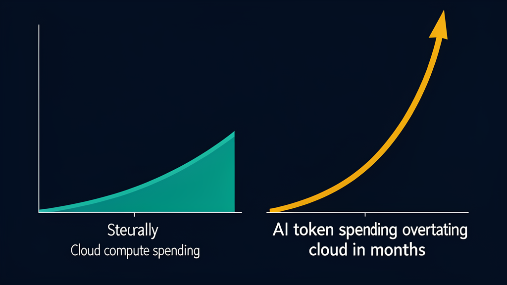

Uber burned through its entire 2026 AI budget by April.

Four months. Five thousand engineers had adopted Claude Code at a clip that went from 32% usage to 84% in under a year. The per-engineer cost hit $500 to $2,000 per month. Uber's COO told TechCrunch the link between that spend and measurable productivity gains "is not there yet."

Microsoft revoked Claude Code licenses after costs climbed to roughly $2,000 per engineer per month. Everyone got routed back to Copilot. One unnamed enterprise, according to TechCrunch and Forbes, dropped $500 million in a single month on Claude after failing to configure spend limits. $500 million. One month. Priceline's Cursor contract renewal came back four to five times more expensive than the previous term. A Priceline executive called it "like the crack-cocaine epidemic."

These stories are early signals of a reckoning that has barely started, and the companies at the centre of it are not outliers or early adopters gone wrong. They are the ones who went first, and their billing statements are a preview of what everyone else will see next quarter.

## How we got here

Two things happened at once, and the timing could not have been worse for corporate finance teams. AI coding tools got good enough that engineers started using them for production work instead of side projects. Adoption was bottom-up and blind to the finance department. Nobody ran it past FinOps. At the same time, billing shifted to per-token pricing, a model that ties cost to usage in a way that seat-based SaaS never did.

Token prices dropped 90% or more over the past two years. You would think cheaper tokens mean lower bills.

They don't. Spending doubled. Apollo's chief economist Torsten Slok identified this as textbook Jevons paradox: when a resource gets cheaper, consumption expands to swallow the savings and then some. Engineers who would have been judicious with expensive tokens started piping every task through an AI agent because the per-call cost felt negligible. Small bug? Agent it. Code review? Agent it. Refactor this module? Agent it. The habit compounds. Quietly.

Gartner projects $207 billion in AI agent software spending for 2026, up 139% from 2025. Ramp's AI Index, which tracks corporate AI spend across thousands of companies, puts the median organisation at $11.38 per employee per month. The top 1% are at $7,450. A 680x gap. Widening every quarter.

## The cloud cost replay

If you have been in engineering long enough, this script is familiar.

Cloud computing followed the same arc. Cheap compute drove adoption. Nobody tracked costs. Then the bill arrived, large and incomprehensible, and the FinOps movement was born from that hangover.

The parallels run deep. Cloud billed by compute-hours and storage. AI bills by token consumption: input, output, cached. Both promised productivity gains that turned out to be slippery to quantify at the org level. Both required entirely new cost-allocation models because per-seat licenses and departmental budgets could not capture the consumption pattern. Both produced a generation of tools for monitoring and rationalizing spend.

The difference is speed. Cloud took a decade to reach the "oh shit" moment. AI coding tools hit it in under 18 months. Eighteen months. That is the entire story.

J.R. Storment, one of FinOps's founders, launched the Tokenomics Foundation under the Linux Foundation because he saw the exact same dynamics that defined cloud cost management now replaying in token billing, only faster and at a scale that makes the cloud era look like a dress rehearsal. He told TechCrunch that companies are already three times over their entire 2026 token budget, and it is only April. He described the effort as "FinOps for AI tokens." The name is on the nose. The problem is the same one the cloud industry spent a decade solving.

OpenAI's enterprise head confirmed the shift. Customer conversations have already moved from "what can it do?" to "what token controls do you have?" Fast.

## What companies are doing about it

The responses fall into three buckets, and none of them are pretty.

Caps first. Per-engineer monthly token budgets are becoming standard at companies that have been through their first sticker-shock billing cycle. Microsoft pulling Claude Code and defaulting everyone to Copilot is effectively a cap. Smaller companies are setting hard dollar limits per developer and routing overages through manager approval. The Tokenomics Foundation is working on standardised measurement frameworks so that organisations can compare per-token productivity across teams.

Monitoring is the second bucket. Ramp and Jellyfish have both launched token-tracking products in the last year. Faros AI expanded its existing platform. Jellyfish's data is the sharpest: engineers who consume the most tokens are roughly twice as productive as low-usage peers, but they burn ten times the tokens to get there. Per-developer token consumption rose 18.6x over nine months. That is a steep return curve. Twice the output for ten times the cost. You do the math.

Faros AI, tracking 20,000 developers over two years, found that output metrics are rising, which sounds great until you look at the full picture. Commits are up. PRs are up. Shipped features are up. So are bugs and rewrites. The signal is noisier than the marketing suggests.

Tool selection is the third lever. Priceline's experience with Cursor has pushed companies to benchmark total cost of ownership across agents rather than just comparing per-seat pricing. Claude Code's official docs estimate $13 per developer per active day, or $150 to $250 per month for typical usage. That is a floor. The ceiling is much higher. OpenAI's GPT-5-Codex charges $1.25 per million input tokens and $10 per million output tokens. A production agent pipeline that generates heavy output tokens, say a large-scale refactoring with subagent delegation, can blow past that floor in a single sprint.

The most dramatic enforcement came from Google Cloud. The company suspended Railway, a $2 million per month customer, via an automated billing action. Eight hours dark. Railway had not configured billing alerts. Call it prudent cost enforcement or reckless vendor overreach. The takeaway for engineering orgs is the same: your provider can and will cut you off if your AI spend spikes without warning.

## The productivity question

Here is the part that makes people uncomfortable. The data says these tools work. Jellyfish's heavy users are twice as productive. Faros AI's two-year dataset confirms rising output. But "twice as productive at ten times the cost" is not a productivity miracle. It is a tradeoff, and whether it makes financial sense depends entirely on what you measure.

I run Claude Code and Codex daily through Hermes, an agent platform I work with. OpenCode too, when I need a leaner harness for something the heavier tools would over-engineer. I can feel the token dynamics in my own API bills every single month. A complex refactoring task that used to eat an entire afternoon now finishes while I grab coffee. The token cost for that same task runs four to five times what a non-agent approach would have cost in raw compute. Whether that tradeoff pencils out depends on how you value engineer time. At fully-loaded market rates, agent tokens look cheap. As a cost centre competing with headcount, the math gets harder. Much harder.

Most organisations have not done that calculation. They adopted AI coding tools the way they adopted cloud services: assume it's cheap, measure it later. Wrong the first time. Wrong again.

## What to do about it

Start with visibility. You cannot manage what you cannot measure. Right now most companies cannot measure their token spend at anything close to the granularity that matters for actual decision-making. Run a logging proxy at the API boundary. Systima, the team behind the Claude Code token-overhead study I wrote about last month, open-sourced their measurement rig: roughly 200 lines of Node that sit between your harness and the model endpoint, logging every request body and usage block. You need per-engineer, per-tool, per-task token consumption before you can set caps that make sense.

Set per-engineer budgets. A developer writing boilerplate all day burns fewer tokens than one running architectural refactors through agents. Both might be productive. Budget based on output value rather than seat count.

Benchmark total cost of ownership across tools. Claude Code's $150 to $250 per month is a marketing baseline. Your real cost, once you factor in subagent fan-out and production workloads, may be several multiples of that number. MCP server overhead adds more. The comparison that matters is not "Claude Code versus Copilot per seat." It is value delivered per dollar of token spend.

And do not let adoption outrun governance. The companies getting hammered right now are the ones that let engineers sign up for AI tools on corporate credit cards. They only noticed the bill when quarterly finance reviews rolled around. The cloud cost playbook applies directly. The FinOps discipline transfers without modification. The only new variable is speed.

## The real story

The token bill is a correction, a sign that AI coding tools hit production scale before anyone built the financial controls around them, and that the people who adopt fastest are the ones who get hurt earliest. AI coding tools produce real gains. The question was never whether they work. It was whether the economics work at scale, under unmanaged adoption, with per-token billing.

For a lot of companies in 2026, the answer is "not yet." The math does not close yet.

The companies that survive the AI cost reckoning will be the ones that build cost discipline early, that treat token billing as an operating expense rather than a magic productivity button. They track what they spend. They match token budgets to the value the tools deliver. The FinOps playbook has been written. Engineering orgs can read it now, or they can burn through another few hundred million dollars and read it later. Their choice.
