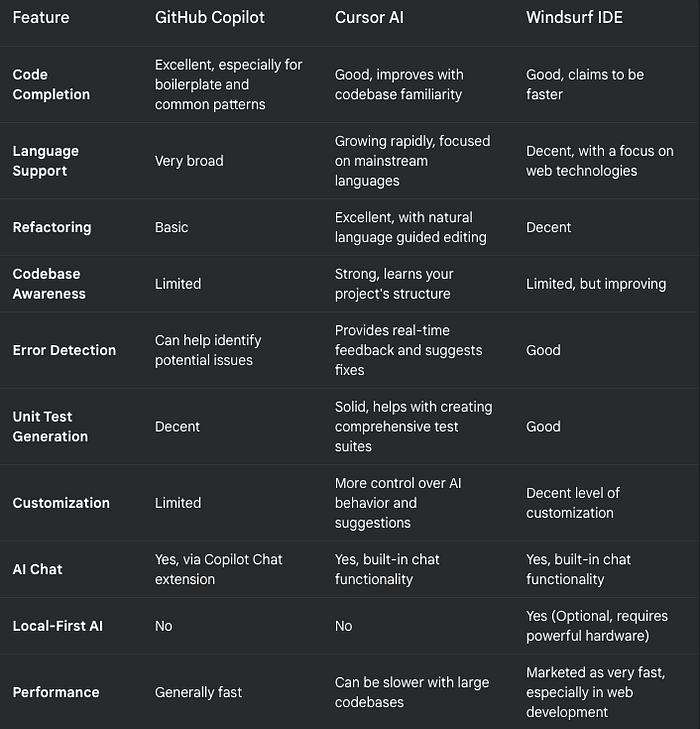

The AI revolution is in full swing, and it's changing the way we write code faster than we can say "segmentation fault." We've moved beyond simple code completion to having full-fledged AI companions that can understand our code, suggest improvements, and even write entire blocks of logic for us. As seasoned developers, the question is no longer if we should embrace these tools, but which one best suits our needs.

Previously, we looked at GitHub Copilot and Cursor AI. Now, there is a new contender in the arena: Windsurf IDE. Let's dive into this three-way battle and see how these AI coding powerhouses stack up against each other.

## A Quick Flyby: Copilot, Cursor, and Now Windsurf

Let's refresh our memory and introduce our new challenger:

- **GitHub Copilot:** The veteran, developed by GitHub and OpenAI, trained on a massive dataset of public GitHub repositories. It offers strong code completion, broad language support, and now boasts Copilot Chat, an in-editor AI assistant.
- **Cursor AI:** An AI-first IDE, Cursor is built from the ground-up for AI-powered coding. It excels at refactoring, understanding your codebase, and providing a natural language interface for code editing. It also features a robust built-in AI chat.
- **Windsurf IDE:** The newcomer, positioned as a faster, more web-focused AI coding tool. It's built with a local-first approach, meaning all AI computations can be performed on your own device, ensuring privacy and speed. Like Cursor, it's an IDE designed specifically for AI development.

## Feature Breakdown: Strengths and Weaknesses

Let's dissect each tool's strengths, focusing on what matters most to us as developers:

### GitHub Copilot

**Strengths:**

- Vast Training Data: Unmatched breadth of code examples it's learned from.
- Excellent Code Completion: Especially for common patterns and boilerplate.
- Wide Language Support: Covers virtually every popular language.
- Copilot Chat: A powerful addition for getting code explanations and generating code from natural language.
- Mature and Widely Adopted: Large community, extensive documentation.

**Weaknesses:**

- Limited Codebase Understanding: Primarily focuses on the current file, not the entire project.
- Basic Refactoring: Not its strongest suit.

### Cursor AI

**Strengths:**

- Superior Refactoring: Helps optimize and improve existing code.
- Deep Codebase Knowledge: Learns your project's structure for tailored suggestions.
- Natural Language Editing: Modify code with simple instructions.
- Built-in AI Chat: Seamlessly integrated into the coding workflow.

**Weaknesses:**

- Smaller Training Data: Compared to Copilot.
- Higher Price Point: More expensive than Copilot.

### Windsurf IDE

**Strengths:**

- Local-First AI (Optional): Offers the ability to run the AI models locally, enhancing privacy and potentially speed if you have a powerful machine with a dedicated GPU.
- Web-Focused: Built with web technologies in mind, potentially leading to smoother performance for web development.
- Fast Performance: Claims to be faster than competitors in terms of response time.
- Built-in AI Chat: Facilitates a more interactive coding experience.

**Weaknesses:**

- Newer Entrant: Smaller community, potentially fewer resources.
- Less Mature: May have some rough edges compared to more established tools.
- Requires High-End Hardware for Optimal Local Performance: To get the most out of local AI, you'll need a machine with a powerful GPU.
- Codebase Understanding: According to the article shared, the codebase understanding is not as good as Cursor.

## The Price of Progress: Comparing Costs

- GitHub Copilot: $10/month or $100/year for individuals. Includes Copilot Chat.
- Cursor AI: $20/month for the basic plan (for individuals).
- Windsurf IDE: Offers a free tier with limited features. The Pro plan (for individuals) is $15/month.

### Capabilities Compared: A Three-Way Showdown

## The Verdict: Which AI Co-pilot Should You Choose?

The "best" tool depends on your specific needs and priorities. Here's a breakdown to help you decide:

**Choose GitHub Copilot if:**

- You want a reliable, widely-used tool with excellent code completion.
- You need support for a vast range of programming languages.
- You want a cost-effective solution that includes powerful chat features.
- You value a large community and extensive resources.

**Choose Cursor AI if:**

- Refactoring and improving existing code is a top priority.
- You want an AI that deeply understands your codebase.
- You prefer a natural language interface for code editing.
- You're willing to pay a premium for advanced features.

**Choose Windsurf IDE if:**

- Data privacy is paramount, and you want the option to run AI models locally.
- You primarily work on web projects.
- You value raw speed and responsiveness and have a powerful GPU.
- You're willing to try a newer, less mature tool with the potential for rapid development.

**Final Thoughts:**

The AI coding landscape is evolving at breakneck speed. Copilot, Cursor, and Windsurf each offer a unique take on AI-assisted development. I strongly encourage you to take advantage of their free trials (or free tiers) to experiment and see which one best fits your workflow. With these powerful tools at our disposal, we can spend less time on mundane tasks and more time on the creative, problem-solving aspects that make software development so engaging. The future of coding is here, and it's intelligent!
