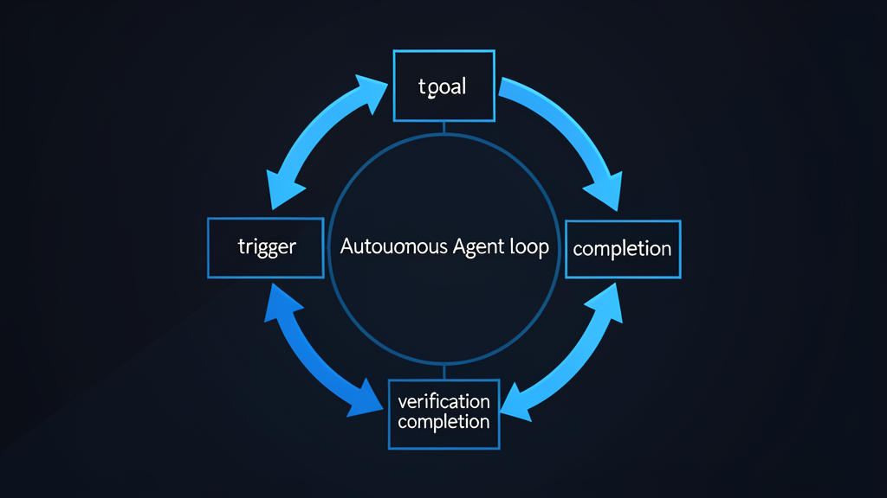

# Loop Engineering on a $1.3M Budget

Last week, Peter Steinberger posted a screenshot of his monthly AI bill. The number: $1,305,088.81. He burned through 603 billion tokens running roughly 100 autonomous agents on his open-source project. OpenAI picked up the tab.

On the same day, Boris Cherny, the person who built Claude Code, said in an interview: "I don't prompt Claude anymore. I have loops that are running. My job is to write loops."

The message from the frontier of AI engineering is clear: stop prompting, start designing loops. But there's a detail nobody mentions. Steinberger's employer pays his bill. Cherny works at Anthropic. The people evangelizing loop engineering have effectively infinite tokens.

What about everyone else?

## What's a loop, really

A loop is three things: a trigger, a goal, and a way to verify that goal was reached.

The trigger can be a cron schedule, a webhook, or a human saying "go." The goal needs to be verifiable: tests passing, a health check returning OK, a linter showing zero errors. The verification is what separates a loop from a simple automation. The agent decides whether it's done. It evaluates its own progress.

This isn't new. The ReAct pattern (Reason + Act) has been around since 2022. CI/CD pipelines are loops. Self-healing systems are loops. What's new is that the tools finally exist to make this accessible: Claude Code's `/loop` command, Cursor Automations, Codex Cloud.

But accessibility and affordability are different things.

## The real cost of running agent loops

The average Claude Code user spends $340 per month on tokens, according to Cohrint, a Claude Code monitoring platform, which analyzed 200+ engineering teams in Q1 2026. Senior engineers in active sprints hit $600 to $800. Agent-heavy users report $500 to $2,000 monthly.

Where does the money go? MorphLLM, an AI token analytics company, tracked every token across 42 agent runs and found that 70% of tokens were waste. The agent re-read files it had already seen. It explored irrelevant code paths. It repeated searches. The actual code generation, the part you want, accounted for just 5 to 15% of total tokens.

And when loops go wrong, they go *expensive*-wrong. CloudAtler documented a case they call the "Infinite Loop of Death": a $50,000 bill from an agent trapped in a recurring failure cycle with no exit condition.

The math of autonomous failure is brutal even with good design. If each step in a loop is 95% reliable, a 20-step loop succeeds only 36% of the time. Real loops are more complex than independent coin flips, and well-designed systems can recover from partial failures. But the compounding risk is real: more steps mean more chances for something to break.

## Budget loop engineering: the $0.05 loop

The insight that changes the economics: verification doesn't have to come from the LLM.

Anthropic's own best practices say: "Give Claude a check it can run: tests, a build, a screenshot to compare. It's the difference between a session you watch and one you walk away from."

When you replace LLM-as-judge with shell-based checks — `pytest`, `ruff`, `curl -sf localhost:8888/health` — you save the tokens that would have been spent on the verification call itself. No model input, no model output. Just an exit code.

I built an infrastructure self-healing loop on my own server. It's a simple loop: the simplest tier of what loop engineering can look like. It runs every 30 minutes: checks service health, disk space, Docker containers, recent cron failures. All shell commands. All deterministic. If everything is healthy, it stays silent. If something breaks, it attempts one automatic fix and alerts me only if the fix fails.

The model cost per run: roughly $0.05. It runs 48 times a day. That's about $2.40 a day, or roughly $70 a month for 24/7 infrastructure monitoring with self-healing. On its first real run, it caught a port mismatch I'd misconfigured. A human would have noticed hours later.

## Three tiers for real budgets

Based on Cohrint's $340 average, MorphLLM's agent-heavy user range, and my own experience at the lowest tier, loop engineering at different budget levels looks something like this.

**$50–100 per month: Cron loops with shell verification.** You run scheduled checks using cheap models (or scripts with no model at all). Infra monitoring, automated test runs, issue triage. You verify with exit codes, not LLM calls. This is where my self-healing loop lives. It's not glamorous, but it runs 24/7 and costs less than a Spotify subscription.

**$200–400 per month: Agent loops with model routing.** This is where most individual developers land. You use Sonnet-tier models for 80% of tasks and reserve expensive reasoning models for the 20% that genuinely need them. PR self-healing, article quality checks, code reviews. Verification is hybrid: deterministic checks first, selective LLM evaluation for ambiguous cases. The trick is knowing when to spend tokens and when to save them.

**$500–2,000 per month: Full agentic loops.** This is the territory of maker/checker splits, where one agent writes and another reviews. Overnight feature development. Multi-file refactors. This is the tier where the Steinberger-style workflows become viable — but with hard circuit breakers to prevent the $50,000 scenario. At this budget, you're spending real money, and the safeguards matter more than the model.

Every tier needs the same safeguards: action history tracking to prevent repeating the same failed approach, hard caps on max iterations, and structured reflection when the loop gets stuck. Building a reliable orchestration layer with all of these is real engineering work, not a weekend project. But the ongoing token cost stays low when verification is deterministic.

## The loop doesn't care about your budget

The Bun runtime was recently ported from Zig to Rust using Claude Code's dynamic workflows — roughly 750,000 lines of code, 6,755 commits, 99.8% of the existing test suite passing, eleven days from first commit to merge. Anthropic highlighted it as a flagship case study.

But the code hasn't been deployed to production. The maintainer said there's a "high chance all this code gets thrown out." Passing tests and shipping to production are different things. This is the verification problem that budget loop engineering solves: by keeping loops short, verifiable, and deterministic, you stay in control.

Steinberger's own framing is telling: "If tokens no longer matter, how will we build software in the future?" That's a fine question for someone whose tokens don't matter. For the rest of us, a better question: how do we design the most efficient loop with the tokens we have?

The answer doesn't require $1.3 million. It requires a trigger, a goal, a shell script, and the discipline to stop the loop when it stops making progress.