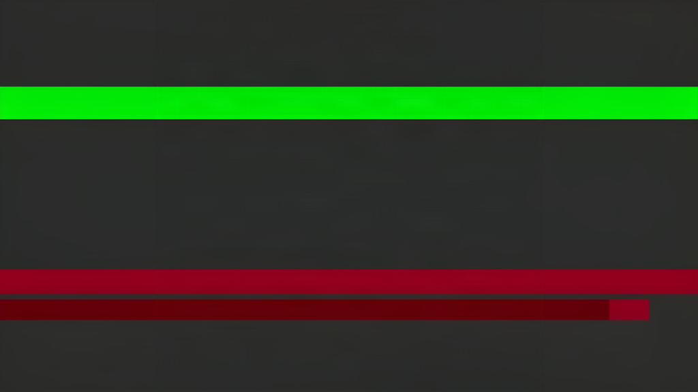
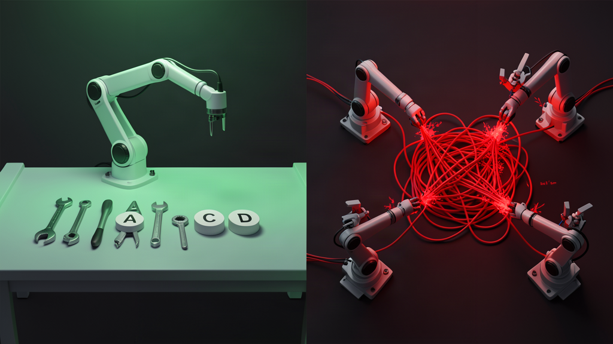

A Google engineer posted something last month that stopped my scroll. Their team had spun up a six-agent system to handle a complex code analysis pipeline. Each agent had a specialized role: one parsed dependencies, one traced data flows, one generated test cases, one wrote fixes, one reviewed, one deployed. The architecture diagram was beautiful. The system was a disaster.

Latency tripled. Two agents kept rewriting each other's output in a refinement loop that burned through an afternoon of API budget producing nothing. A third agent hallucinated a deprecated API and passed it as fact to the verification agent, which validated it because the code looked syntactically correct. Nobody noticed for three days because the system did not crash. It returned confident, well-formatted, wrong results. The team scrapped the whole thing and went back to a single agent with better tools. The pipeline got faster, cheaper, and more reliable overnight.

That story is not an outlier. It is the default outcome for teams that reach for multi-agent architectures before they need them, which is most teams in 2026.

## The numbers say what the hype won't

Google and MIT published the first systematic scaling study for agent systems in late 2025, testing 180 configurations across different task types. Their headline finding: multi-agent coordination improved performance by 80.9% on parallelizable tasks but degraded performance by 39% to 70% on sequential reasoning. That is not a tradeoff. That is a cliff. And most real engineering work involves sequential reasoning.

The degradation has a mathematical explanation. A paper from April 2026, published by researchers who tested single-agent systems against multi-agent architectures across three model families, proved it using the Data Processing Inequality. Under equal token budgets, a single agent is provably more information-efficient than a multi-agent system. The gains that multi-agent systems appear to show disappear the moment you normalize for compute. You were not getting smarter coordination. You were buying more thinking time.

This is the finding that the multi-agent ecosystem has been quietly sidestepping. The benchmark improvements that launched a thousand framework startups were confounded by unaccounted computation. More agents means more tokens means more test-time reasoning. Remove the extra compute and the architectural advantage evaporates.

## The failure taxonomy nobody reads

UC Berkeley's Sky Computing Lab built the first empirically grounded failure taxonomy for multi-agent LLM systems. They called it MAST, and it catalogs 14 distinct failure modes across 1,600 annotated execution traces from seven popular frameworks. The failures cluster into three categories: specification issues, where agents misunderstand the task, inter-agent misalignment, where agents disagree or duplicate work, and task verification, where the system cannot detect its own errors.

The most damaging failure mode is the one you never see. A multi-agent system does not crash when it fails. It returns a confident, plausible answer built on a broken sub-task. Agent A produces a subtly wrong output. Agent B treats it as ground truth and builds on it. Agent C refines B's work without questioning the foundation. By the time Agent E delivers the final result, the error is baked in and invisible. Your monitoring shows green. The output looks correct. It is not.

The reliability math makes this inevitable. If each agent in a chain succeeds independently with 95% probability, a five-agent chain delivers roughly 77% end-to-end success. At 90% per-agent reliability, which is optimistic for most production LLM workflows, five agents give you 59%. You are building a system that fails four times out of ten and has no way to know when.

## What coordination actually costs

Every additional agent introduces overhead that does not appear in architecture diagrams.

Token costs multiply silently, and this is where most teams get their first unpleasant surprise. Each agent needs context about the task, its specific role within the coordination protocol, the outputs of every other agent it interacts with, and enough background to make independent decisions without constantly deferring back to the orchestrator for clarification. CrewAI, one of the most popular multi-agent frameworks, carries a measured 56% token overhead compared to equivalent single-agent workflows. That is before counting the duplicate work that happens when two agents independently research the same question because the orchestrator's task decomposition was not as clean as the architecture diagram suggested. Anthropic, who built one of the few multi-agent systems that genuinely outperforms single-agent baselines on their internal research benchmarks, reports that their research system uses 15 times more tokens than a standard chat interaction. They are upfront about the tradeoff. The system works because it spends enough tokens to brute-force the problem, and for breadth-first research across thousands of web pages, that tradeoff pays for itself.

Latency compounds at every handoff. Each coordination step adds 50 to 200 milliseconds of pure overhead. A five-step workflow eats a quarter-second to a full second before any agent does useful work. For batch processing, that is tolerable. For interactive systems, it is disqualifying.

Then there is error amplification. When a single agent fails, the failure is local and predictable. When a multi-agent system fails, the error cascades. Centralized orchestrators amplify errors by 4.4 times. Independent agent meshes amplify by 17.2 times. The more agents you add, the more aggressively your failures compound.

## The narrow window where swarms win

None of this means multi-agent systems are useless. They are overkill for most tasks and exactly right for a few.

Anthropic's research system achieved a 90.2% improvement over single-agent Claude on complex information retrieval. The key word is complex. The task involved exploring hundreds of independent paths across the web, synthesizing information that exceeded any single context window, and returning a grounded answer. That is genuine breadth-first parallelism. Few engineering tasks have that structure.

Google's scaling study found that multi-agent systems begin to outperform single agents when three conditions align: tasks are genuinely parallelizable, context exceeds 30K tokens, and tool counts pass 10. Below those thresholds, a single well-prompted agent with good tools wins every time. The threshold is rising as models improve. Tasks that needed agent teams in 2024 fit comfortably inside a single model's capability envelope in 2026.

The honest summary from production data: fewer than 10% of enterprise multi-agent deployments achieve their scaling targets. Most teams that switch to multi-agent architectures regret it within three months.

## What I run every day

I orchestrate AI coding agents daily. Claude Code, OpenAI Codex, and a platform I help maintain that coordinates autonomous engineering tasks across multiple agents and tools. The delegation pattern is seductive: spawn a subagent for research, another for implementation, another for review. Each gets a clean context window. Each specializes. The architecture feels right.

In practice, the overhead eats the gains for most tasks. A single Claude Code instance with a well-structured prompt and the right MCP servers handles a feature implementation faster than a three-agent pipeline where one agent writes, one reviews, and one fixes. The review agent's feedback loop adds two full round-trips of latency. The fixing agent rewrites code the writer already got right the first time because the reviewer's feedback was stylistic rather than substantive. Context that should flow linearly from problem statement to solution gets compressed, transmitted across an agent boundary, partially reconstructed, and then re-compressed for the next handoff. Information loss is guaranteed. The question is whether what survives is enough.

The pattern that actually works in production is selective delegation, and the word selective is doing heavy lifting in that sentence. One orchestrator agent that holds the full context and makes a deliberate, explicit decision about when to spawn a subagent. Not for every task. For tasks where the context genuinely exceeds what one agent can hold in a single window, or where the work decomposes into genuinely independent subtasks that can run in parallel without sequential dependencies. Research sprints across multiple sources. Multi-file refactors across a large codebase where different agents handle different modules. Security audits that benefit from adversarial cross-checking where one agent proposes and another attacks. Those are the narrow cases where the coordination tax pays for itself, and they are a small fraction of the work that most engineering teams actually do.

For everything else, and "everything else" is most things, one agent with good tools and a tight prompt wins. It is faster. It is cheaper. It is debuggable. When it fails, you have one trace to inspect instead of five interleaved ones that each tell a different version of what went wrong.

## The architecture decision

The industry is absorbing the wrong lesson from the multi-agent hype cycle. The lesson is not that multi-agent systems are bad. The lesson is that they are expensive, fragile, and over-applied. Framework vendors have every incentive to make agent swarms sound like the natural evolution of AI architecture because more agents means more API calls means more revenue. The incentives are aligned against simplicity.

Start with one agent. Add a second only when a distinct, separable capability demands it, and document exactly why that capability cannot live inside the first agent. Validate every inter-agent handoff against a schema, because the most expensive failures are the ones where a downstream agent accepts a plausible but wrong input without question. Set hard token budgets and step limits on every loop, because unbounded refinement cycles between agents can consume a month of API budget in a single afternoon. Instrument end-to-end tracing from day one, because the failures you need to catch are the silent ones where the system returns confidently wrong answers and your dashboards stay green.

The best multi-agent system is the one you did not build. The second-best is the one with two agents instead of five. The worst is the one with a beautiful architecture diagram and a 59% success rate.

Frontier models have closed the gap that justified multi-agent architectures in the first place. Context windows hold 200K tokens. Tool calling is reliable. Sustained reasoning across extended interactions works. The edge that agent swarms offered in 2024 has been absorbed into single-agent capability. What remains is the coordination tax, the failure modes, and the token bill.

One agent. Good tools. Tight prompt. Done.
